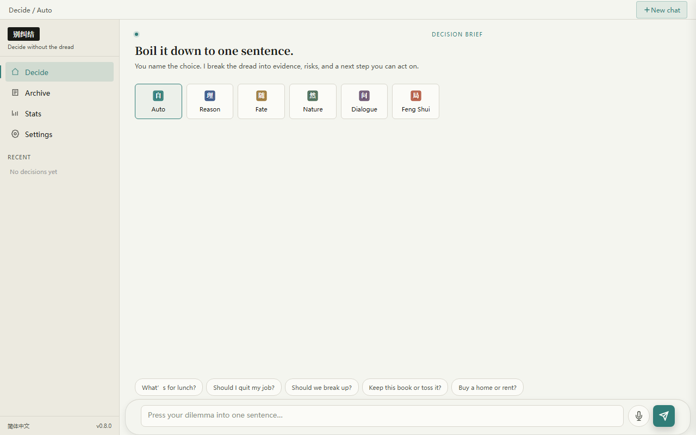
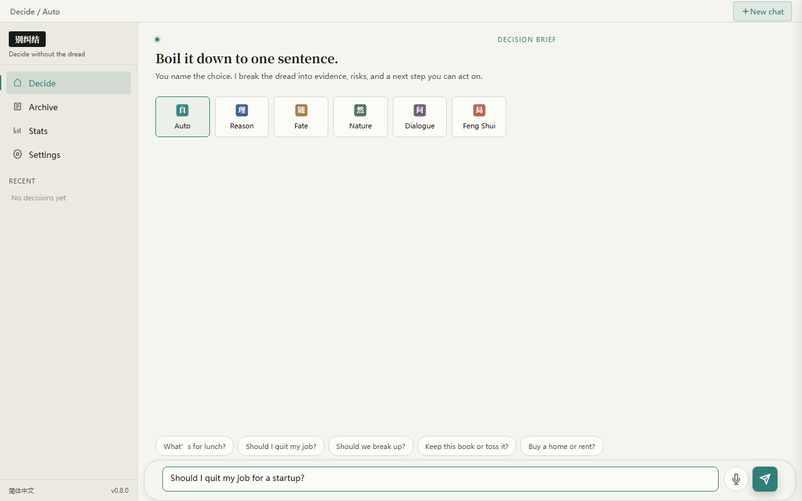
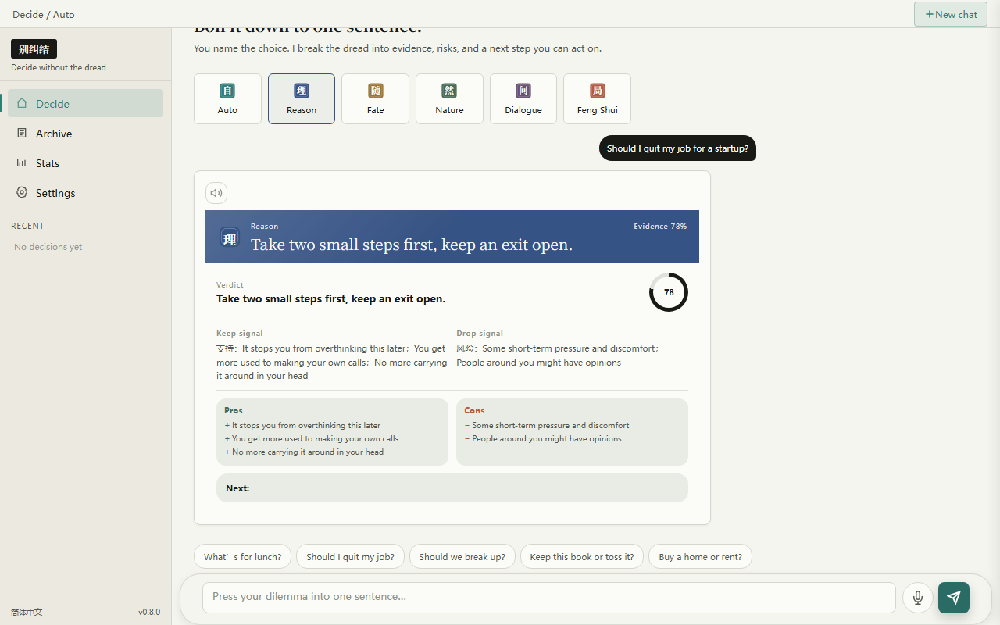
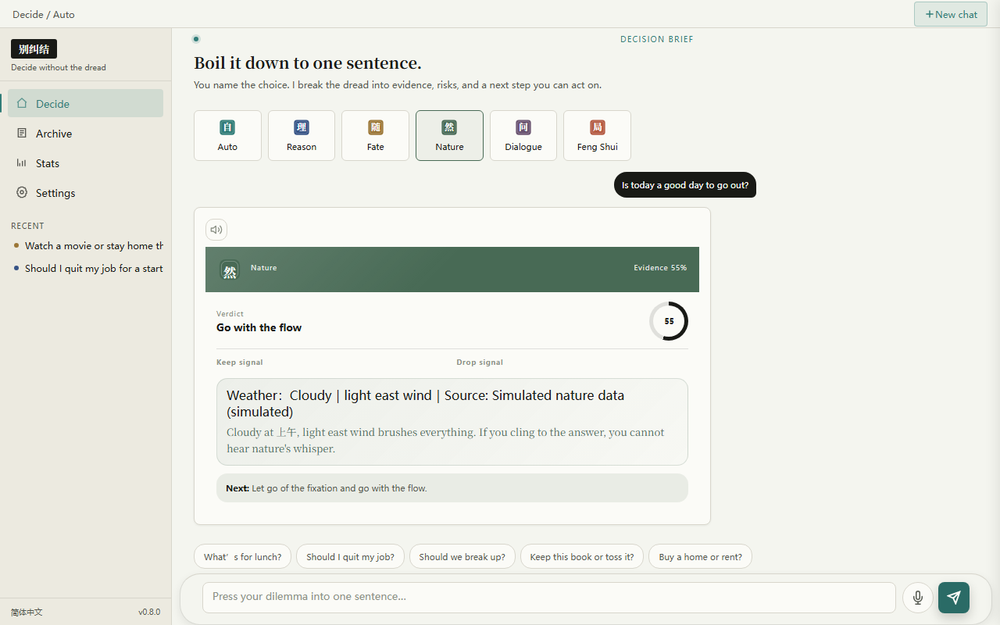
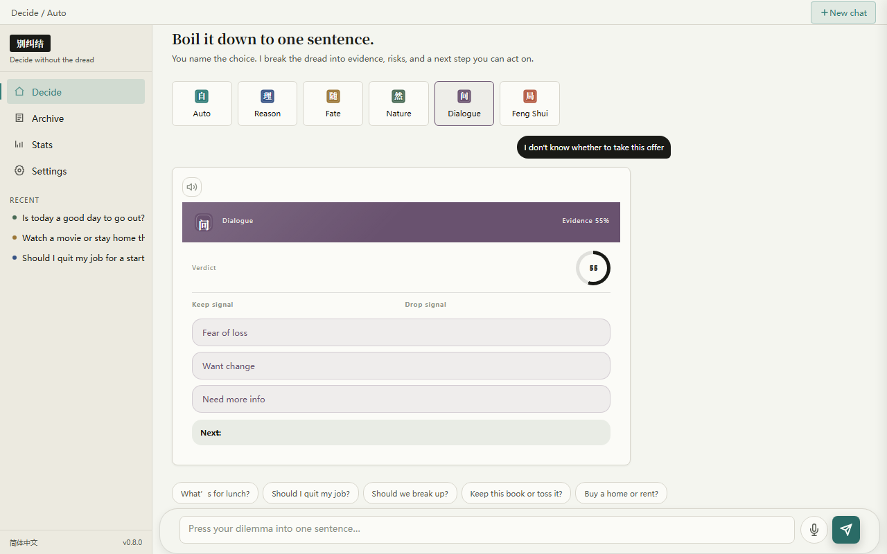
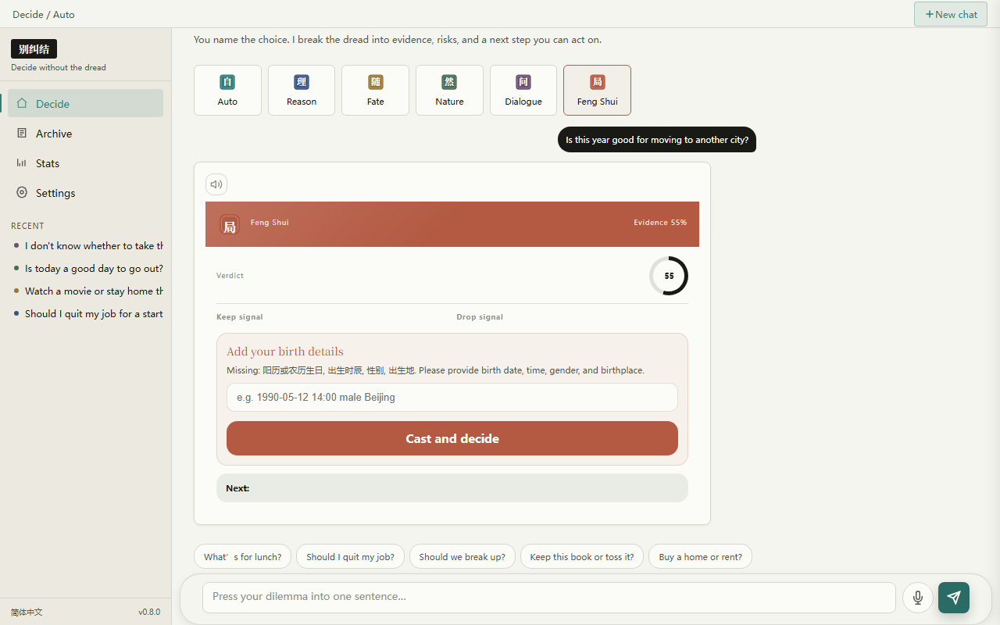
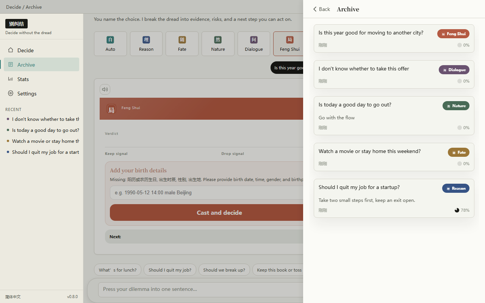
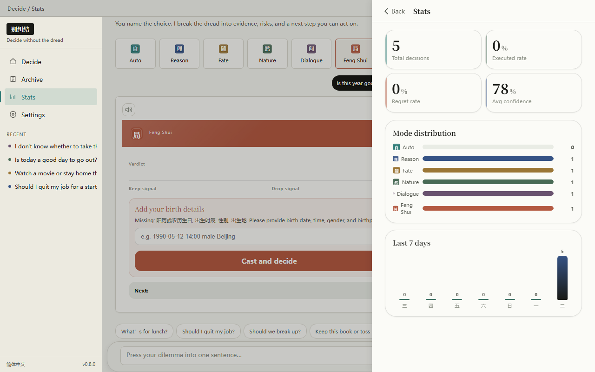
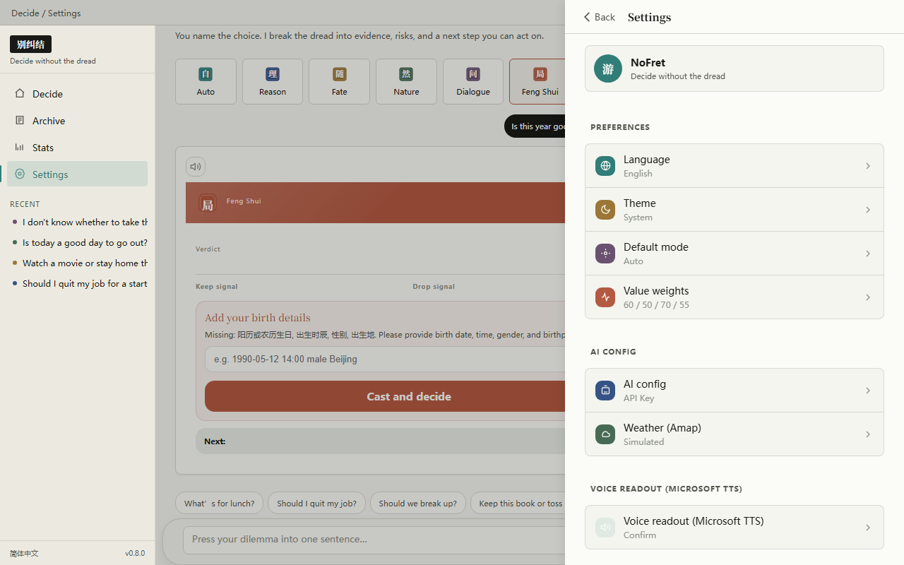

# Decision Brief · 别纠结

<p align="center">
  <video src="docs/demo.mp4" alt="Decision Brief demo" width="920" autoplay loop muted playsinline>
    
  </video>
</p>

<p align="center">
  <strong>Compress your dilemma into one sentence.</strong><br>
  Text, voice, or photo — you name the choice. We turn anxiety into evidence, risks, and a next step you can act on.
</p>

<p align="center">
  
  
  
  
  
</p>

<p align="center">
  <a href="README.md">中文</a> · <a href="https://choice.example.com">Live Demo</a> · <a href="docs/index-en.html">Intro Page</a>
</p>

---

## In One Sentence

**Decision Brief (别纠结)** is a local-first decision-making assistant. It does not decide for you — it untangles your overthinking into verifiable evidence, visible risks, and a concrete first move.

Type (or speak, or attach a photo), pick one of six lenses (or let "Auto" choose), and get a structured decision brief in seconds. Every decision is auto-archived. Mark it executed or regretted later. Review your patterns over time.

## Quick Start

```bash
# 1. Install dependencies
pip install -e ".[dev]"      # dev mode
# or
pip install -r requirements.txt

# 2. Run the server
cd backend
python main.py
```

Open in your browser:

- Web UI: <http://localhost:8000/>
- API docs: <http://localhost:8000/docs>
- Health check: <http://localhost:8000/api/health>

**Works out of the box**: without an LLM key, the server returns well-formed mock briefs so you can explore the full UI. Weather service is built-in, no sign-up needed. Drop in your own OpenAI-compatible API key (vision models like GPT-4o, Doubao-vision, or Qwen-VL unlock photo input) to enable real AI analysis.

## Six Lenses

<p align="center">
  
</p>

| Lens | Seal | When to use | What you get |
| --- | :---: | --- | --- |
| **Auto** | 自 | You aren't sure which lens fits — let the router pick | Best-fit lens, chosen from your wording |
| **Rational** | 理 | Quitting a job, buying a house, big-ticket purchases | Pros / risks / reversibility / smallest next step / confidence score |
| **Random** | 随 | Lunch, movie, which road to take — low-stakes calls | Shortlist + a randomized pick, with a little ceremony |
| **Nature** | 然 | Stuck emotionally, relationship calls, needing perspective | Time of day, weather, wind direction, natural signals |
| **Dialogue** | 问 | You already know the answer but can't admit it | 3–5 rounds of questions that help you hear yourself |
| **Fengshui** | 局 | Timing, direction, five-element balance for extra context | BaZi chart + favorable elements + daily direction |

## Screenshots

<p align="center">
  
  
  
  
  
  
  
  
</p>

## Highlights

- **🎴 Seal-style mode picker**: six single-character Chinese seal buttons (自 / 理 / 随 / 然 / 问 / 局) on a paper-textured canvas
- **⌨️🎙️🖼️ Tri-modal input**: a spacious rounded composer card that supports typing, voice dictation, and image upload (multimodal vision)
- **💬 Streaming chat**: briefs render segment by segment, with a confidence ring and highlighted keywords
- **📁 Archive**: every decision saved automatically; mark as executed / regretted; open details; delete; sidebar refreshes live
- **📊 Statistics**: execution rate, regret rate, mode distribution, and timeline review
- **🔊 TTS readout**: Edge TTS with selectable voices (free, no key required); optional auto-speak preference
- **🌦️ Built-in weather**: set your city and get real-time weather as context for the Nature lens (Amap API, key bundled)
- **🌗 Light / Dark / System themes**, saved locally and persisted across reloads
- **🌍 6 languages**: Simplified Chinese, Traditional Chinese, English, French, Japanese, Spanish
- **💾 Local-first**: persisted in SQLite (WAL mode); your data stays on your machine
- **🖥️ Responsive**: two-pane + drawer on desktop, single-pane on mobile; the composer is roomy and comfortable on every screen
- **🔌 CLI + Web dual entry**: both use the same backend and database
- **🧪 Graceful mock mode**: the full flow works without any API key for easy preview and development

## The Composer

The input area is a large rounded card in the style of modern AI chat apps:

- **Left**: image upload button (tap to pick a photo; thumbnail preview with one-tap remove; up to 5 MB)
- **Middle**: multi-line textarea (auto-grows, Shift+Enter for newline, Enter to send)
- **Right**: microphone for voice input + a teal send button

When a vision model is configured, photos are sent in the standard OpenAI multimodal format, so the model can look at your image and give advice grounded in what it sees.

## Configuring your LLM Key

On first launch, open **Settings → AI Config** and paste any OpenAI-compatible key (OpenAI, MiniMax, DeepSeek, Moonshot, local Ollama, Doubao, etc.). Without a key the server returns mock data so you can try everything.

Environment variables (highest priority):

```bash
export CHOICE_LLM_API_KEY=sk-xxx
export CHOICE_LLM_MODEL=gpt-4o-mini          # swap to gpt-4o / qwen-vl for images
export CHOICE_LLM_BASE_URL=https://api.openai.com/v1
export CHOICE_WEATHER_CITY=Beijing           # weather key is bundled, city only
```

Save to SQLite via CLI:

```bash
python scripts/choice_assistant.py --action config-api --save-to-db \
  --api-key sk-xxx \
  --llm-model gpt-4o-mini \
  --llm-base-url https://api.openai.com/v1 \
  --weather-city Beijing
```

## CLI Usage

```bash
# One-shot decision
python scripts/choice_assistant.py -q "Should I take the new job offer?"
python scripts/choice_assistant.py -q "What should I have for dinner?" --mode random

# Archive & stats
python scripts/choice_assistant.py --action archive
python scripts/choice_assistant.py --action stats

# Manage a single decision
python scripts/choice_assistant.py --action decision --id <id>
python scripts/choice_assistant.py --action decision --id <id> --delete
```

See [SKILL.md](SKILL.md) for the full parameter list.

## Tech Stack

| Layer | Tech |
| --- | --- |
| Backend | Python 3.9+ / FastAPI / SQLite (WAL) / httpx |
| Frontend | Vanilla HTML · CSS · JavaScript (zero build step, zero framework) |
| CLI | Python argparse + httpx, shares backend & DB with the Web UI |
| AI | Any OpenAI-compatible endpoint (bring your own key; vision models enable multimodal image input) |
| TTS | Microsoft Edge TTS (free, no key required; selectable voices) |
| STT | Browser-native Web Speech API (free) |
| Weather | Amap Web API (key bundled, works out of the box) |
| Tests | pytest + Playwright (UI automation) |

## Project Structure

```
choice-skill/
├── backend/              # FastAPI backend
│   ├── main.py           # Entrypoint & static file mount
│   ├── config.py         # 3-tier config (env / SQLite / file) + bundled weather key
│   ├── db.py             # SQLite wrapper
│   ├── routes/           # chat / archive / stats / config / tts / modes
│   └── services/         # LLM (multimodal) / mode router / bazi / weather / scorer
├── frontend/             # Static web UI (no build tools)
│   ├── index.html
│   ├── scripts/          # app / chat / archive / stats / settings / voice / i18n / api / brief
│   └── styles/           # main / chat / archive / stats / settings / desktop
├── scripts/              # CLI entry
├── tests/                # pytest + Playwright test suite
├── docs/                 # GitHub Pages intro, screenshots, animated GIF
├── SKILL.md              # Skill spec & invocation examples
└── README.en.md          # This file
```

## License & Credits

- **License**: MIT, see [LICENSE](LICENSE)
- **Thanks to**:
  - BaZi engine inspired by [jinchenma94/bazi-skill](https://github.com/jinchenma94/bazi-skill) (MIT)
  - De-AI-ification style inspired by [op7418/humanizer-zh](https://github.com/op7418/humanizer-zh)
- **External services**:
  - LLM: any OpenAI-compatible endpoint (bring your own key; vision models for images)
  - TTS: Microsoft Edge TTS (built-in, free)
  - STT: browser Web Speech API (free)
  - Weather: Amap Open Platform (built-in key, works out of the box)

---

<p align="center">Stop overthinking. Start moving.<br>Made with ❤️ for people who overthink.</p>
