# Decision Brief · 别纠结

<p align="center">
  <strong>Compress your dilemma into one sentence.</strong><br>
  Text, voice, or photo — you name the choice. We turn anxiety into evidence, risks, and a next step you can act on.
</p>

<p align="center">
  
  
  
  
  
</p>

<p align="center">
  <a href="https://mianbaofang.github.io/decision-brief/index-en.html">
    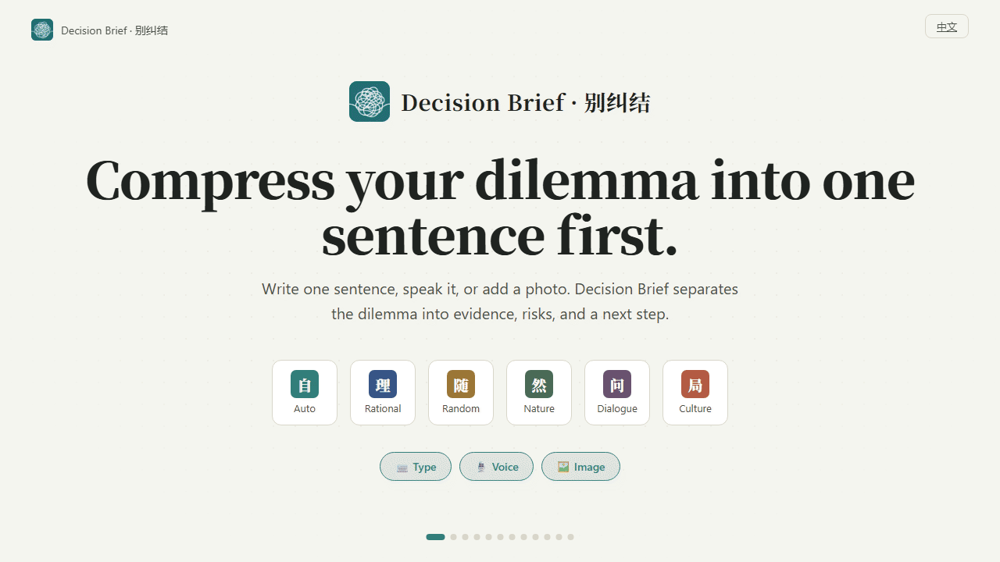
  </a>
</p>

<p align="center">
  <a href="README.md">中文</a>
  ·
  <a href="DISCLAIMER.md">Disclaimer</a>
  ·
  <a href="ACKNOWLEDGEMENTS.md">Acknowledgements</a>
  ·
  <a href="https://github.com/mianbaofang/decision-brief/issues/new/choose">Feedback</a>
  ·
  <a href="docs/releases/v0.9.0.md">v0.9.0 Release Notes</a>
  ·
  <a href="https://mianbaofang.github.io/decision-brief/">Chinese Intro</a>
  ·
  <a href="https://mianbaofang.github.io/decision-brief/index-en.html">English Intro</a>
</p>

## Why I Built This

The idea for Decision Brief came from tidying up a room with my daughter.

She's in sixth grade. That day we were sorting through her room together — desks, cabinets, drawers full of stuff: old notebooks, little toys, stickers, craft projects, half-used stationery, and a few things she herself couldn't decide whether to keep or not.

The hard part wasn't the cleaning. It was that every step required a choice.

Should this stay? Is that still usable? Does this have sentimental value? Do I do the desk first or the drawers? What if I throw it away and miss it later?

What looks simple to an adult isn't simple to a child. Many things have some reason to keep, and some reason to let go. She wasn't unwilling to clean — she just needed a moment to think about each small decision. Think too much, and you get tired. The room stays messy.

That moment made me realize: adults are the same. Our "rooms" are just work, life, relationships, and plans.

Many choices aren't without answers — they're just tangled together. Emotion, risk, habit, attachment, fear of regret, all squeezed into one question. Someone telling you "just pick this" doesn't necessarily help, because the person who has to live with the result is still you.

So I wanted to build a tool that helps lay choices out first.

It doesn't decide for you — "keep or toss," "do it or don't." It's more like someone sitting beside you asking a few questions: Why do you want to keep it? What happens if you don't? How big is the cost really? Is there a tiny first step you could try?

That's the original intention behind Decision Brief. I want it to solve a very specific scenario: when you're stuck on a pile of small judgments, you have a lightweight tool that helps you articulate the problem, separate the reasons, and make the next step feel less heavy.

That's why this demo isn't just a random wheel. Random works for "what should I eat for dinner" — low-stakes calls — but not for every choice. And I didn't make it into a complicated productivity system either, because when you're stuck in overthinking, you usually don't have the patience to fill out forms. One sentence should be enough to start.

The current design offers several entry points: Rational looks at benefits, risks, reversibility, and value alignment; Random can settle a small low-stakes choice; Nature and Traditional Culture offer another perspective; Dialogue asks follow-up questions when the reason for the hesitation is still unclear.

The boundary I care about most: it can only assist your choice; it cannot bear the choice for you. Especially with life decisions, what really matters isn't whether the answer "looks right," but whether you've thought through why you're choosing it. If it can move someone from "I don't know what to do" to "I know what first step I can take," it has done its job.

**Decision Brief (别纠结)** is a local-first AI decision assistant and decision-support tool with a Web UI, CLI, and Codex Skill. It runs on FastAPI + SQLite and connects to OpenAI-compatible APIs. It does not decide for you; it separates a dilemma into evidence, risks, and a next step.

> Read [Disclaimer](DISCLAIMER.md) before use. This project is decision support only; it is not legal, medical, financial, psychological, or other professional advice.

## At A Glance

| Scenario | Output |
|---|---|
| One-sentence dilemma | Evidence, risks, trade-offs, and a next action |
| Six lenses | Rational analysis, random choice, nature metaphor, traditional-culture reference, guided dialogue, and auto mode |
| Multimodal input | Text, voice, and image input flow into the same decision brief |
| Review loop | Local archive, execution status, regret tracking, and decision-pattern review |

## In One Sentence

Type (or speak, or attach a photo), pick one of six lenses (or let "Auto" choose), and get a structured decision brief in seconds. Every decision is auto-archived. Mark it executed or regretted later. Review your patterns over time.

## Feature Map

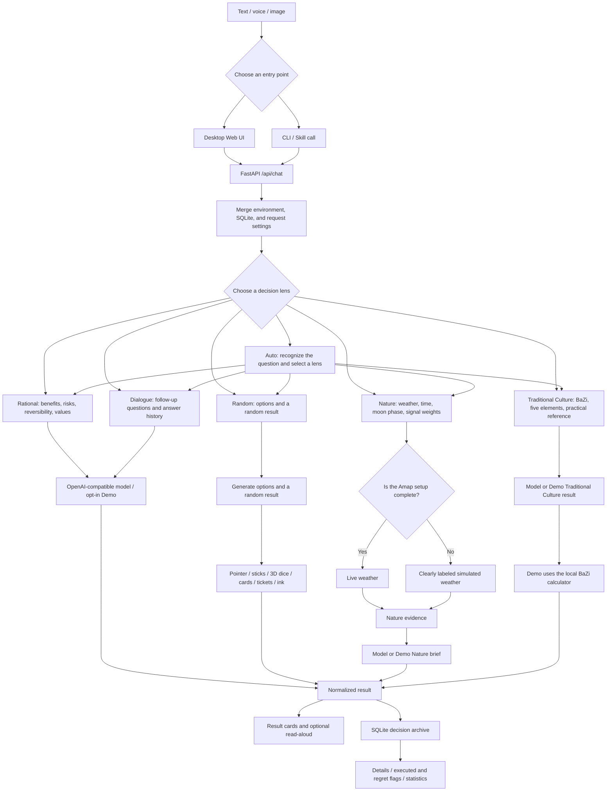
```mermaid
flowchart TD
    INPUT["Text / voice / image"] --> ENTRY{"Choose an entry point"}
    ENTRY --> WEB["Desktop Web UI"]
    ENTRY --> CLI["CLI / Skill call"]
    WEB --> CHAT["FastAPI /api/chat"]
    CLI --> CHAT
    CHAT --> CONFIG["Merge environment, SQLite, and request settings"]
    CONFIG --> ROUTER{"Choose a decision lens"}
    ROUTER --> AUTO["Auto: recognize the question and select a lens"]
    ROUTER --> RATIONAL["Rational: benefits, risks, reversibility, values"]
    ROUTER --> RANDOM["Random: options and a random result"]
    ROUTER --> NATURE["Nature: weather, time, moon phase, signal weights"]
    ROUTER --> DIALOGUE["Dialogue: follow-up questions and answer history"]
    ROUTER --> CULTURE["Traditional Culture: BaZi, five elements, practical reference"]
    AUTO --> RATIONAL
    AUTO --> RANDOM
    AUTO --> NATURE
    AUTO --> DIALOGUE
    AUTO --> CULTURE
    RATIONAL --> GENERATOR["OpenAI-compatible model / opt-in Demo"]
    DIALOGUE --> GENERATOR
    RANDOM --> OPTIONS["Generate options and a random result"]
    OPTIONS --> EFFECTS["Pointer / sticks / 3D dice / cards / tickets / ink"]
    NATURE --> WEATHER{"Is the Amap setup complete?"}
    WEATHER -->|"Yes"| AMAP["Live weather"]
    WEATHER -->|"No"| MOCK["Clearly labeled simulated weather"]
    AMAP --> NATURE_EVIDENCE["Nature evidence"]
    MOCK --> NATURE_EVIDENCE
    NATURE_EVIDENCE --> NATURE_RESULT["Model or Demo Nature brief"]
    CULTURE --> CULTURE_RESULT["Model or Demo Traditional Culture result"]
    CULTURE_RESULT --> BAZI["Demo uses the local BaZi calculator"]
    GENERATOR --> RESULT["Normalized result"]
    EFFECTS --> RESULT
    NATURE_RESULT --> RESULT
    BAZI --> RESULT
    RESULT --> UI["Result cards and optional read-aloud"]
    RESULT --> DB["SQLite decision archive"]
    DB --> ARCHIVE["Details / executed and regret flags / statistics"]
```

## Quick Start

```bash
# 1. Install dependencies
pip install -e ".[dev]"      # dev mode
# or
pip install -r requirements.txt

# 2. Run the server
cd backend
python main.py
```

Open in your browser:

- Web UI: <http://127.0.0.1:8010/>
- API docs: <http://127.0.0.1:8010/docs>
- Health check: <http://127.0.0.1:8010/api/health>

Without an LLM key, the page asks you to configure one or explicitly start Demo mode. Demo results are examples and do not call an AI service. Real analysis needs your own OpenAI-compatible key; image input also needs a vision model such as GPT-4o, Doubao-vision, or Qwen-VL. Live weather in Nature mode needs your own Amap key, weather Base URL, and city. Without the Amap API, the app uses clearly labeled simulated weather.

## Six Lenses

<p align="center">
  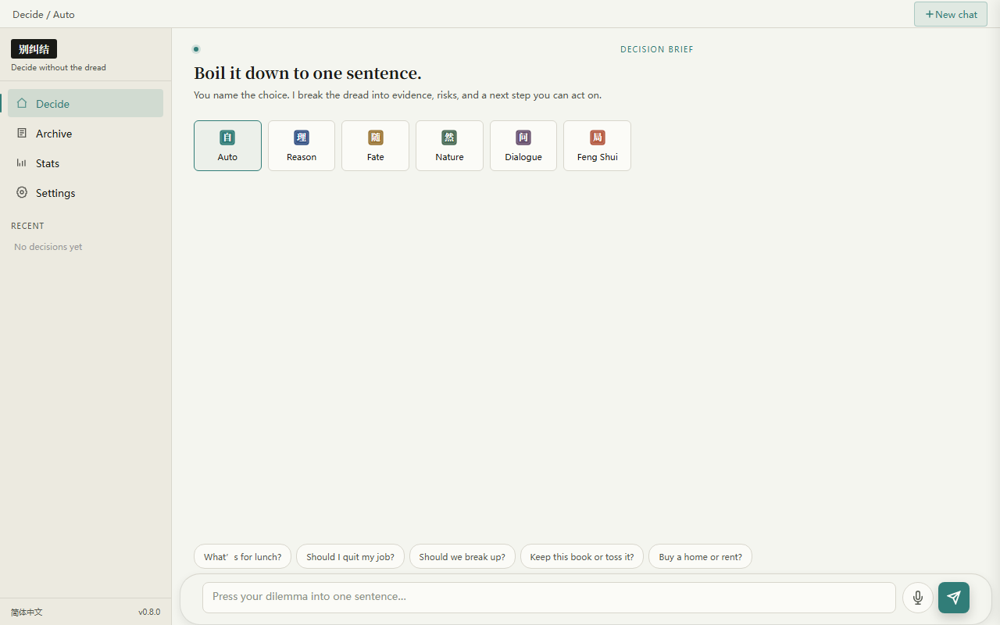
</p>

| Lens | Seal | When to use | What you get |
| --- | :---: | --- | --- |
| **Auto** | 自 | You aren't sure which lens fits — let the router pick | Best-fit lens, chosen from your wording |
| **Rational** | 理 | Quitting a job, buying a house, big-ticket purchases | Pros / risks / reversibility / smallest next step / confidence score |
| **Random** | 随 | Lunch, movie, which road to take — low-stakes calls | Shortlist + a randomized pick, with a little ceremony |
| **Nature** | 然 | Stuck emotionally, relationship calls, needing perspective | Location, time, weather, wind, moon phase, forecast, and signal weights |
| **Dialogue** | 问 | You already know the answer but can't admit it | 3–5 rounds of questions that help you hear yourself |
| **Traditional Culture** | 局 | Looking at a choice through traditional Chinese thought | BaZi chart + five-element reading + practical reference |

## Screenshots

<p align="center">
  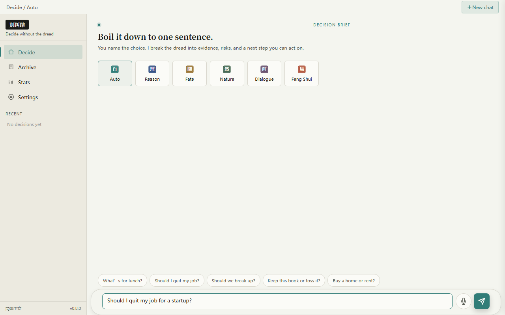
  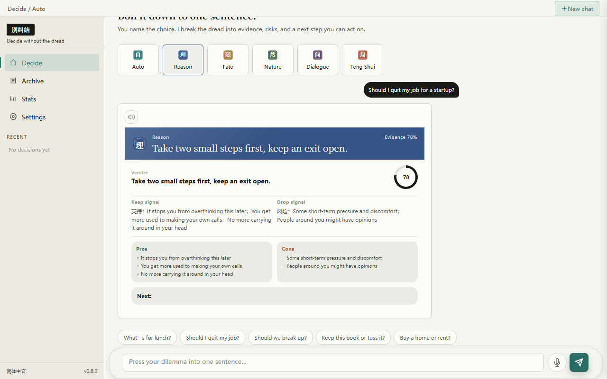
  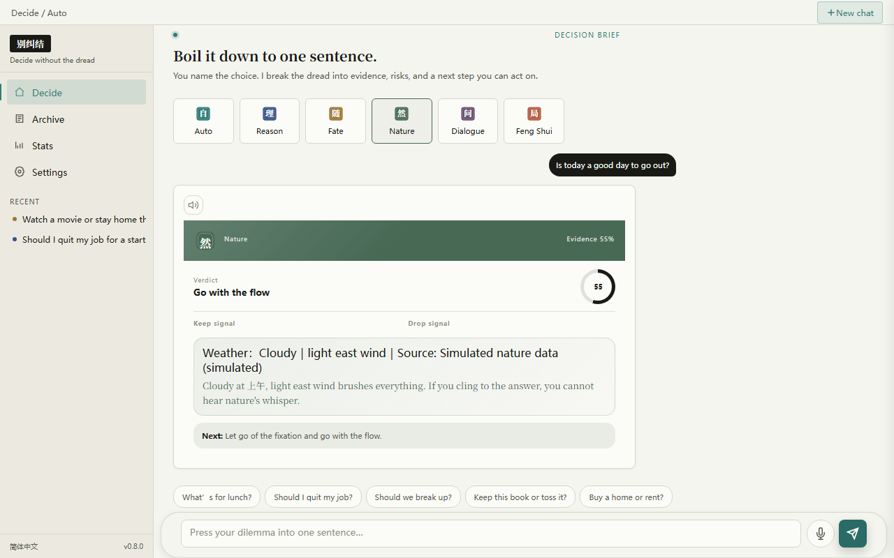
  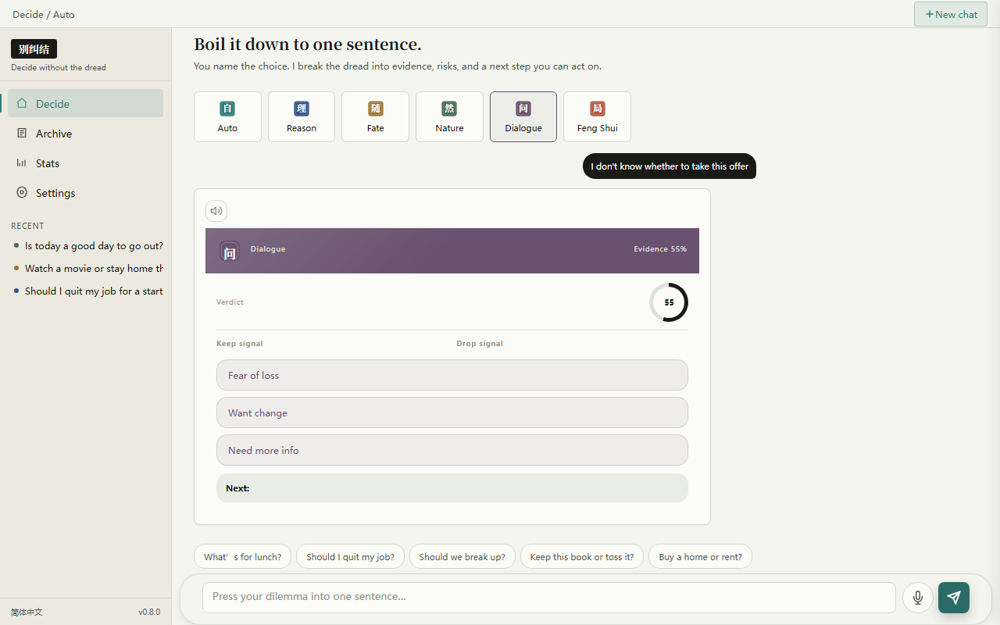
  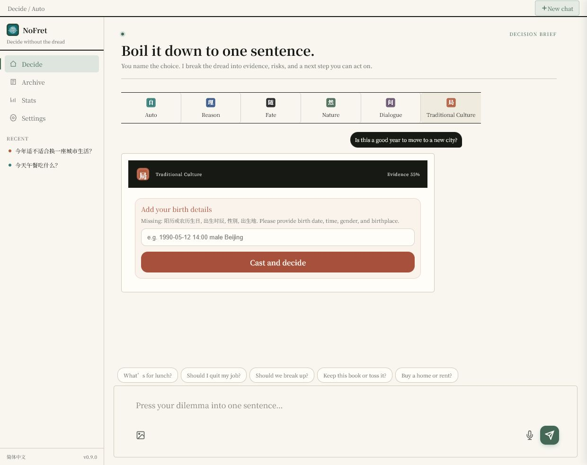
  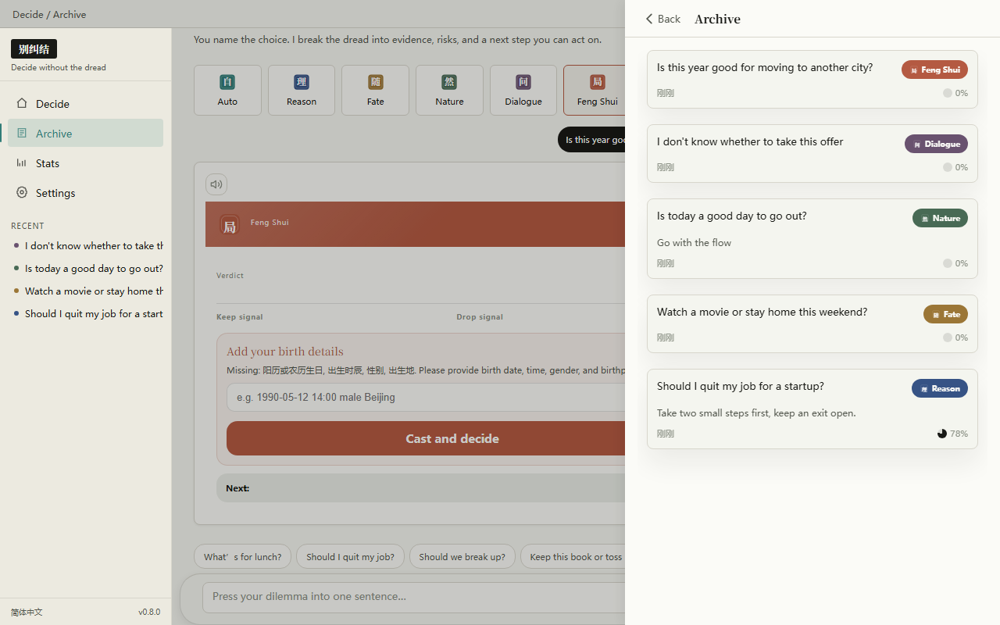
  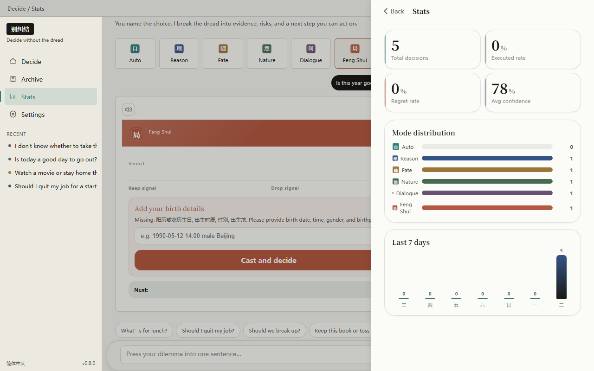
  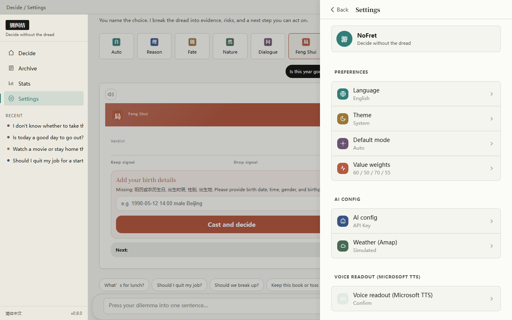
</p>

## Highlights

- **🎴 Seal-style mode picker**: six single-character Chinese seal buttons (自 / 理 / 随 / 然 / 问 / 局) on a paper-textured canvas
- **⌨️🎙️🖼️ Tri-modal input**: a spacious rounded composer card that supports typing, voice dictation, and image upload (multimodal vision)
- **💬 Structured briefs**: each lens has its own result card; Rational shows confidence and decision evidence
- **📁 Archive**: every decision saved automatically; mark as executed / regretted; open details; delete; sidebar refreshes live
- **📊 Statistics**: execution rate, regret rate, mode distribution, and timeline review
- **🔊 TTS readout**: Edge TTS with selectable voices (free, no key required); optional auto-speak preference
- **🎲 Six random effects**: pointer draw, fortune sticks, 3D dice, six-card draw, ticket machine, and ink path, all rendered live in the browser
- **🌦️ Nature inputs**: add your Amap key, weather Base URL, and city for live weather, trends, moon phase, and signal weights; otherwise simulated weather is used
- **💬 Dialogue history**: every follow-up question and selected answer is saved in `dialogueHistory`
- **🎨 Four interface styles**: Heritage, Quiet Workbench, Decision Journal, and Modular Console, plus Light / Dark / System themes
- **🌍 6 languages**: Simplified Chinese, Traditional Chinese, English, French, Japanese, Spanish
- **💾 Local-first**: persisted in SQLite (WAL mode); your data stays on your machine
- **🖥️ Responsive**: two-pane + drawer on desktop, single-pane on mobile; the composer is roomy and comfortable on every screen
- **🔌 CLI + Web dual entry**: both use the same backend and database
- **🧪 Demo preview**: when no LLM key is set, you can explicitly start Demo mode to view sample results

## The Composer

The input area is a large rounded card in the style of modern AI chat apps:

- **Left**: image upload button (tap to pick a photo; thumbnail preview with one-tap remove; up to 5 MB)
- **Middle**: multi-line textarea (auto-grows, Shift+Enter for newline, Enter to send)
- **Right**: microphone for voice input + a teal send button

When a vision model is configured, photos are sent in the standard OpenAI multimodal format, so the model can look at your image and give advice grounded in what it sees.

## Configuring LLM And Weather

On first launch, open **Settings → AI Config** and paste any OpenAI-compatible key (OpenAI, MiniMax, DeepSeek, Moonshot, local Ollama, Doubao, etc.). Without one, submitting a question prompts you to configure a key or explicitly start Demo mode.

For live weather in Nature mode, open **Settings → Weather (Amap)** and enter three fields: Amap Key, weather Base URL, and city. The backend treats weather as configured only when both Key and Base URL are present. Without the Amap API, Nature uses simulated weather and labels it in the UI.

Environment variables (highest priority):

```bash
export CHOICE_LLM_API_KEY=YOUR_API_KEY
export CHOICE_LLM_MODEL=gpt-4o-mini          # swap to gpt-4o / qwen-vl for images
export CHOICE_LLM_BASE_URL=https://api.openai.com/v1
export CHOICE_WEATHER_KEY=YOUR_AMAP_KEY
export CHOICE_WEATHER_BASE_URL=https://restapi.amap.com/v3/weather/weatherInfo
export CHOICE_WEATHER_CITY=Beijing
```

Save to SQLite via CLI:

```bash
python scripts/choice_assistant.py --action config-api --save-to-db \
  --api-key YOUR_API_KEY \
  --llm-model gpt-4o-mini \
  --llm-base-url https://api.openai.com/v1 \
  --weather-key YOUR_AMAP_KEY \
  --weather-base-url https://restapi.amap.com/v3/weather/weatherInfo \
  --weather-city Beijing
```

## CLI Usage

```bash
# One-shot decision
python scripts/choice_assistant.py -q "Should I take the new job offer?"
python scripts/choice_assistant.py -q "What should I have for dinner?" --mode random

# Archive & stats
python scripts/choice_assistant.py --action archive
python scripts/choice_assistant.py --action stats

# Manage a single decision
python scripts/choice_assistant.py --action decision --id <id>
python scripts/choice_assistant.py --action decision --id <id> --delete
```

See [SKILL.md](SKILL.md) for the full parameter list.

## Safety And Boundaries

- This is a decision-support tool. It does not take responsibility for legal, medical, financial, education, employment, or relationship decisions.
- The app is local-first: decision archives are stored in local SQLite unless the user chooses to call a third-party LLM.
- Image inputs are sent to the configured vision model. Think carefully before uploading IDs, medical records, contracts, child photos, or other sensitive images.
- Traditional Culture and Nature lenses are for perspective and entertainment; they should not be the sole basis for serious decisions.
- `.env`, local databases, real API keys, and personal decision records should not be committed to GitHub.

Read [DISCLAIMER.md](DISCLAIMER.md) for the full disclaimer.

## Tech Stack

| Layer | Tech |
| --- | --- |
| Backend | Python 3.9+ / FastAPI / SQLite (WAL) / httpx |
| Frontend | Vanilla HTML · CSS · JavaScript (zero build step, zero framework) |
| CLI | Python argparse + httpx, shares backend & DB with the Web UI |
| AI | Any OpenAI-compatible endpoint (bring your own key; vision models enable multimodal image input) |
| TTS | Microsoft Edge TTS (free, no key required; selectable voices) |
| STT | Browser-native Web Speech API (free) |
| Weather | Amap Web API (bring your own key, Base URL, and city; simulated weather when not configured) |
| Tests | pytest + Playwright (UI automation) |

## Project Structure

```text
decision-brief/
├── backend/
│   ├── main.py                     # FastAPI entrypoint, router registration, static file serving
│   ├── config.py                   # Config priority, secret masking, completeness checks
│   ├── db.py                       # SQLite setup, archive, stats, preferences, and config storage
│   ├── models/
│   │   └── schemas.py              # Request, response, preference, and config models
│   ├── routes/
│   │   ├── chat.py                 # Merge request config, run a lens, and auto-save the result
│   │   ├── archive.py              # Paginated decision archive
│   │   ├── decision.py             # Read, update, or delete one decision
│   │   ├── stats.py                # Execution, regret, lens distribution, and 7-day trend stats
│   │   ├── config_api.py           # LLM, weather, and UI preference settings
│   │   ├── modes.py                # Metadata for the six lenses
│   │   └── tts.py                  # Edge TTS audio and voice endpoints
│   └── services/
│       ├── llm_service.py          # OpenAI-compatible calls, Demo data, result sanitization
│       ├── mode_recognizer.py      # Keyword routing for Auto mode
│       ├── modes_data.py           # Lens names, seals, colors, and descriptions
│       ├── decision_score.py       # Rational scoring
│       ├── nature_service.py       # Nature brief generation and weather evidence merging
│       ├── nature_signal.py        # Alerts, trends, moon, air, and signal weights
│       ├── weather_service.py      # Amap live weather, forecast parsing, simulated weather
│       ├── bazi_engine.py          # Birth-data parsing, BaZi chart, five-element analysis
│       └── prompts.py              # Prompt text for each lens
├── frontend/
│   ├── index.html                  # Desktop shell, drawers, settings, and modals
│   ├── assets/logo-nav.png         # Navigation logo shared with the Mini Program
│   ├── vendor/                     # Local Zdog build and license for the 3D dice
│   ├── random-effects-preview.html # Standalone preview for all six random effects
│   ├── scripts/
│   │   ├── app.js                  # Startup, navigation, drawers, themes, and skins
│   │   ├── api.js                  # API client and frontend lens registry
│   │   ├── chat.js                 # Input, images, submission, and dialogue answer saving
│   │   ├── brief.js                # Result cards and random effect renderers
│   │   ├── archive.js              # Archive list, detail, and status changes
│   │   ├── stats.js                # Statistic cards and charts
│   │   ├── settings.js             # LLM, weather, preferences, skins, and TTS settings
│   │   ├── voice.js                # Browser speech input and Edge TTS playback
│   │   ├── i18n.js                 # Six UI languages
│   │   └── random-preview.js       # Random effect preview controls
│   └── styles/
│       ├── main.css                # Tokens, layout, and composer
│       ├── chat.css                # Messages, result cards, and random effects
│       ├── skins.css               # Four interface styles
│       ├── desktop.css             # Desktop layout
│       ├── archive.css             # Archive and detail views
│       ├── stats.css               # Statistics view
│       ├── settings.css            # Settings and modals
│       └── random-preview.css      # Random effect preview page
├── scripts/
│   └── choice_assistant.py         # CLI / Skill entrypoint using the same API and database
├── tests/
│   ├── test_config.py              # Config priority, masking, weather completeness
│   ├── test_db.py                  # SQLite behavior
│   ├── test_routes.py              # API routes
│   ├── test_services.py            # Decision, weather, and Nature services
│   ├── test_desktop_ui.py          # Playwright desktop interactions and effect checks
│   └── test_integration.py         # Optional running-service integration tests
├── docs/                            # GitHub Pages, screenshots, demos, and release notes
├── SKILL.md                         # Skill parameters, response shapes, and examples
├── CHANGELOG.md                     # Version history
├── README.md                        # Chinese documentation
└── README.en.md                     # This file
```

The browser starts at `frontend/index.html`; the command-line entry is `scripts/choice_assistant.py`. Both call the same FastAPI routes. `routes/chat.py` delegates each request to the matching service, `services/` performs calculations and external calls, and `db.py` stores the result. On the frontend, `brief.js` renders results but does not make backend decisions.

## Open Source And Acknowledgements

- **License**: MIT, see [LICENSE](LICENSE)
- **Open-source dependencies**: FastAPI, Uvicorn, HTTPX, Pydantic, SQLite, pytest, and Playwright.
- **Thanks to**:
  - BaZi engine inspired by [jinchenma94/bazi-skill](https://github.com/jinchenma94/bazi-skill) (MIT)
  - De-AI-ification style inspired by [op7418/humanizer-zh](https://github.com/op7418/humanizer-zh)
- **External services**:
  - LLM: any OpenAI-compatible endpoint (bring your own key; vision models for images)
  - TTS: Microsoft Edge TTS (built-in, free)
  - STT: browser Web Speech API (free)
  - Weather: Amap Open Platform (bring your own key)

See [ACKNOWLEDGEMENTS.md](ACKNOWLEDGEMENTS.md) for the full attribution list.

## Status

Current version: `v0.9.0`. This release adds four interface styles, six random effects, richer Nature evidence, saved dialogue answers, and complete user-managed Amap settings. LLM and Amap credentials are supplied by the user; Demo and simulated weather are clearly labeled in the UI.

---

<p align="center">Stop overthinking. Start moving.<br>Made with ❤️ for people who overthink.</p>
