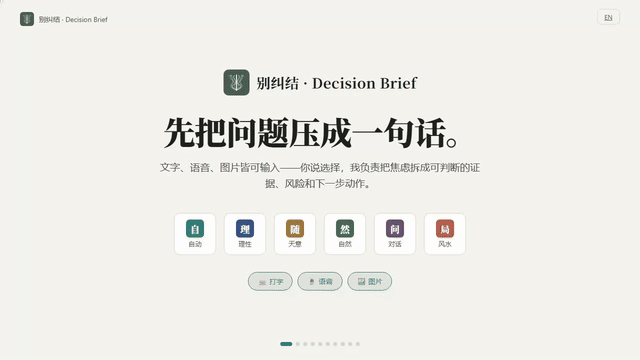
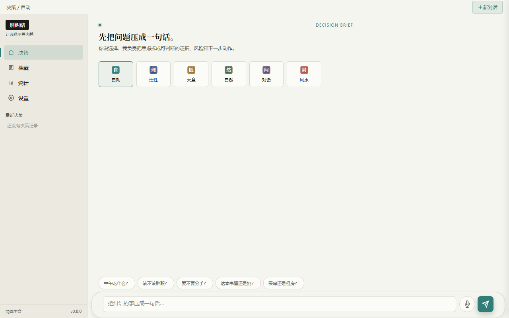
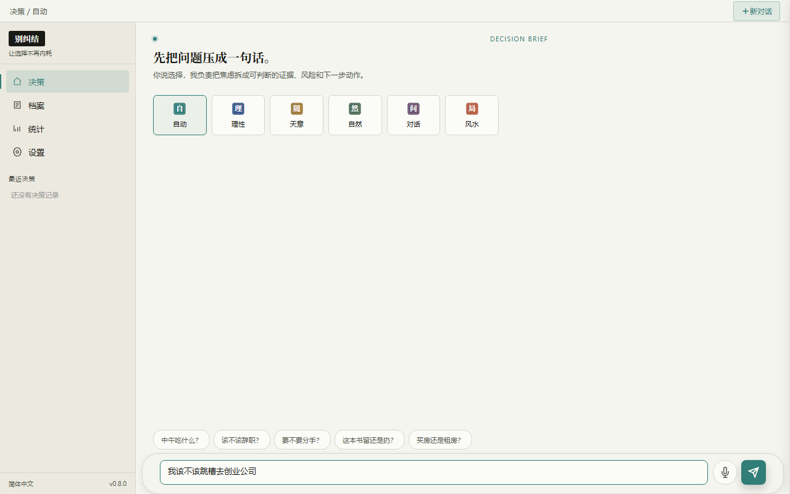
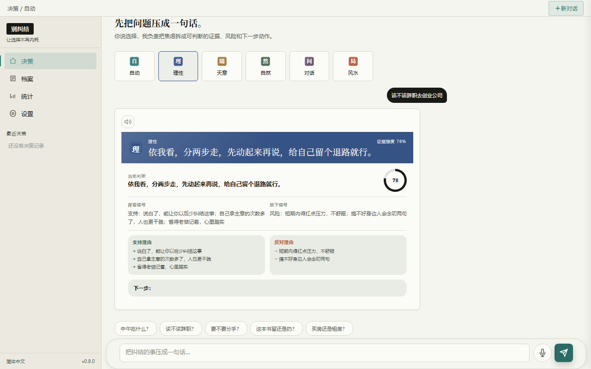
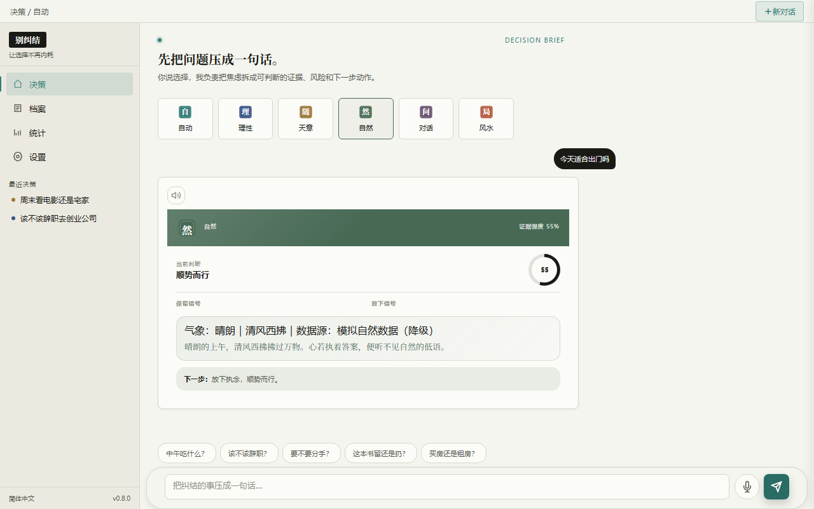
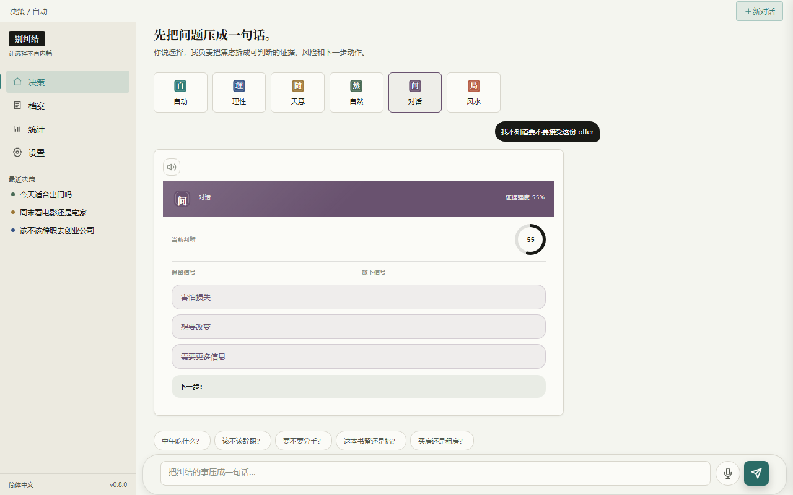
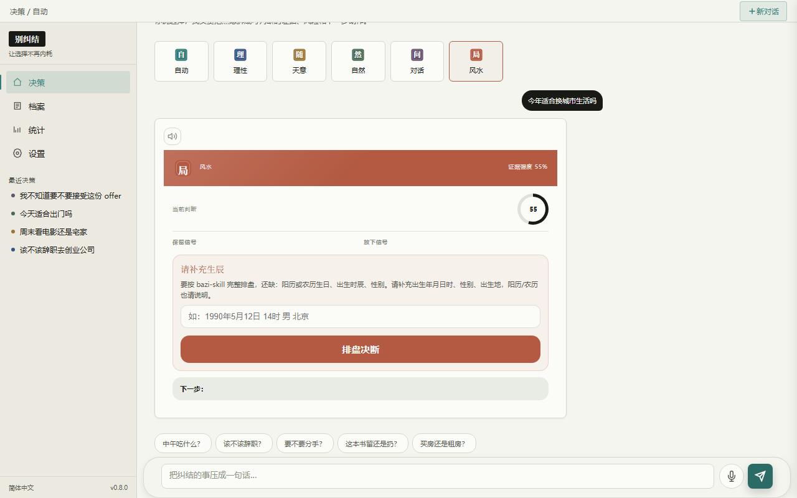
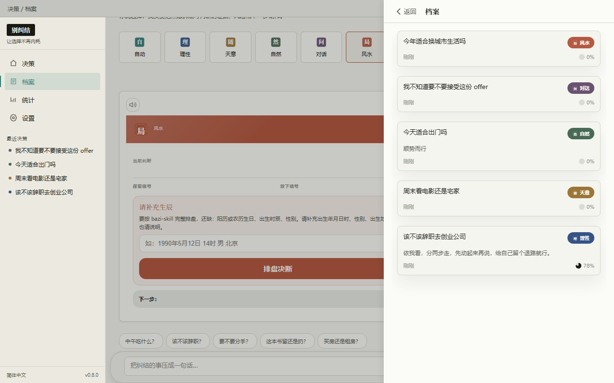
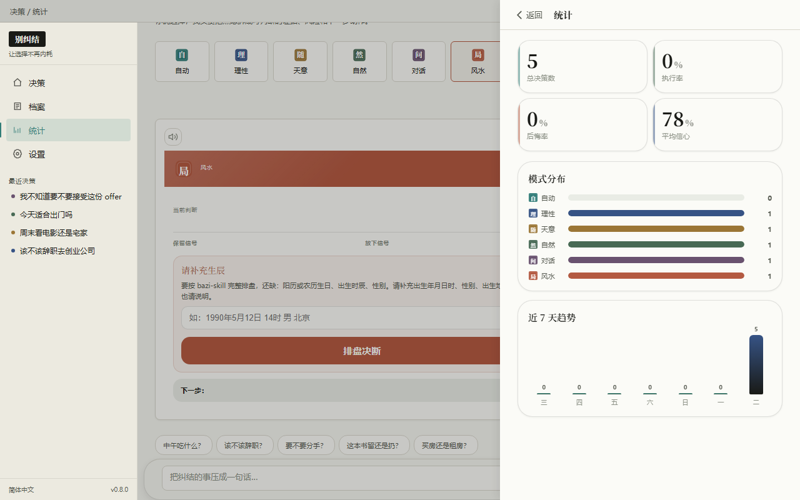
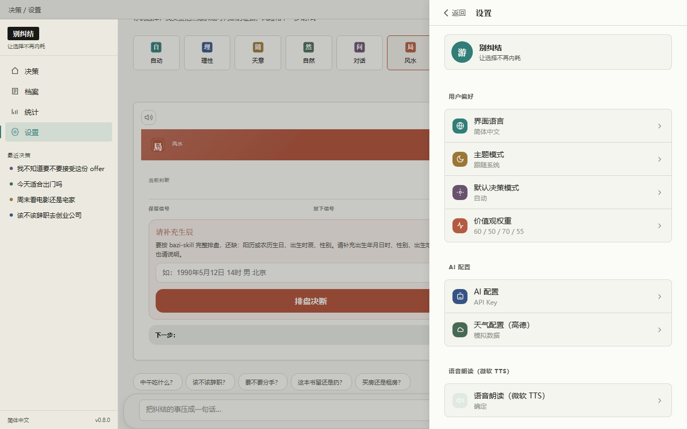

# 别纠结 · Decision Brief

<p align="center">
  <strong>把纠结的事压成一句话。</strong><br>
  你说选择——文字、语音、图片皆可——我负责把焦虑拆成可判断的证据、风险和下一步动作。
</p>

<p align="center">
  
  
  
  
  
</p>

---

## 一句话介绍

**别纠结**是一个本地优先的决策辅助工具。它不替你做决定——它帮你把一团乱麻的纠结，拆成能判断的证据、看得见的风险、走得动的下一步。

输入一句话（也可以配图片、直接说语音），选择六种视角之一（或交给"自动"判断），几秒钟拿到一份结构化的决策简报。所有决策自动归档，可标记执行结果、回看后悔率、复盘决策模式。

<p align="center">
  <a href="https://mianbaofang.github.io/decision-brief/">
    
  </a>
</p>

<p align="center">
  <a href="README.en.md">English</a>
  ·
  <a href="https://mianbaofang.github.io/decision-brief/">中文介绍动画</a>
  ·
  <a href="https://mianbaofang.github.io/decision-brief/index-en.html">English Intro</a>
</p>

## 为什么做这个工具

《别纠结》的灵感，来自一次陪女儿收拾房间。

我女儿上小学六年级。那天我们一起整理她的房间，桌上、柜子里、抽屉里都是东西：旧本子、小玩具、贴纸、手工作品、用了一半的文具，还有一些她自己也说不清还要不要的东西。

真正难的不是收拾，而是每一步都要做选择。

这个要不要留下？那个是不是还能用？这个东西有纪念意义吗？先收书桌，还是先收抽屉？扔掉会不会以后又想起来？

大人看起来很简单的事，对孩子来说并不简单。很多东西都有一点理由留下，也都有一点理由放下。她不是不愿意收拾，而是每个小决定都要想一会儿。想多了，人就累了，房间也迟迟收不完。

那一刻我想到，其实大人也一样。只是我们的"房间"换成了工作、生活、人际关系和各种计划。

很多选择不是没有答案，而是混在一起了。情绪、风险、习惯、舍不得、怕后悔，全挤在一个问题里。别人直接说"你就选这个"并不一定有用，因为真正要承担结果的人还是自己。

所以我想做一个工具，帮人把选择先摊开。

它不替用户决定"该留还是该扔""该做还是不做"。它更像在旁边帮忙问几句：你为什么想留下？如果不留会怎样？这个选择的代价大不大？有没有一个可以先试的小动作？

这就是《别纠结》的初衷。我希望它解决的是这种很具体的场景：当人被很多小判断卡住时，有一个轻一点的工具，帮他把问题说清楚，把理由分开，把下一步变得没那么重。

所以这个 Demo 没有只做成随机转盘。随机适合"今天吃什么"这种低成本小事，但不适合所有选择。我也没有把它做成很复杂的效率系统，因为人在纠结的时候，通常没有耐心填很多表格。最好是一句话就能开始。

现在的设计里，有几种不同的入口：想认真分析就用理性分析看收益、风险、可逆性和价值匹配；只是小事卡住了可以用随机决策给自己一个推动；想换个角度可以看看自然启示或风水参考（仅作参考和娱乐）；如果连自己为什么纠结都说不清，就用对话引导让系统一步步追问。

我最在意的边界是：它只能辅助选择，不能替人承担选择。尤其是很多生活里的决定，真正重要的不是"答案看起来对不对"，而是用户有没有想明白自己为什么这样选。如果能让一个人从"我不知道怎么办"变成"我知道可以先做哪一步"，它就有价值了。

## 快速开始

```bash
# 1. 安装依赖
pip install -e ".[dev]"      # 开发模式
# 或
pip install -r requirements.txt

# 2. 启动服务
cd backend
python main.py
```

打开浏览器访问：

- Web UI：<http://localhost:8000/>
- API 文档：<http://localhost:8000/docs>
- 健康检查：<http://localhost:8000/api/health>

**开箱即用**：未配置 LLM Key 时会返回结构完整的 mock 简报，天气服务已内置，可直接完整体验所有 UI 功能。配好自己的 LLM Key（任意 OpenAI 兼容接口；图片输入需配视觉模型如 GPT-4o、Doubao-vision、Qwen-VL 等）后即启用真实 AI 分析。

## 六种决策视角

<p align="center">
  
</p>

| 视角 | 印章 | 适用场景 | 交付物 |
| --- | :---: | --- | --- |
| **自动** | 自 | 不知道用哪种模式，让系统根据问题内容路由 | 自动匹配最合适的视角 |
| **理性分析** | 理 | 辞职、买房、大额消费等高后悔成本选择 | 收益 / 风险 / 可逆性 / 最小下一步 / 信心分 |
| **天意随机** | 随 | 吃什么、看什么、走哪条路等低风险小事 | 候选项 + 随机结果 + 小仪式感 |
| **自然启示** | 然 | 情绪卡住、关系选择、需要换个角度 | 时间 / 天气 / 风向 / 自然意象信号 |
| **对话引导** | 问 | 心里已有答案但不敢面对 | 三到五轮追问，帮你听见自己的声音 |
| **风水参考** | 局 | 时机、方位、五行喜忌辅助判断 | 八字排盘 + 五行喜用 + 当日方位参考 |

## 界面预览

<p align="center">
  
  
  
  
  
  
  
  
</p>

## 核心特性

- **🎴 印章式模式选择**：六个单字印章按钮（自理随然问局），中式纸感设计
- **⌨️🎙️🖼️ 三模态输入**：大圆角卡片输入框，支持键盘打字、麦克风语音、上传图片（多模态视觉分析）
- **💬 流式聊天**：简报分段流式输出，配信心环与关键词高亮
- **📁 决策档案**：所有决策自动保存，支持标记"已执行 / 后悔"、查看详情、删除，侧栏实时同步
- **📊 决策统计**：执行率 / 后悔率 / 模式分布 / 时间线复盘
- **🔊 TTS 朗读**：Edge TTS 朗读简报内容，音色可自选（免费、无需 Key），支持自动朗读偏好
- **🌦️ 内置天气**：高德天气 Key 已内置，只需设置城市即可获取实时天气与自然信号
- **🌗 浅色 / 深色 / 跟随系统**：三套主题，本地保存偏好，刷新不丢
- **🌍 6 语言国际化**：简体中文 / 繁體中文 / English / Français / 日本語 / Español
- **💾 本地优先**：SQLite（WAL 模式）持久化，数据只在你自己机器上
- **🖥️ 自适应布局**：桌面端两栏 + 抽屉，移动端单栏 + 底栏，输入区宽大不局促
- **🔌 CLI + Web 双入口**：命令行与浏览器共用后端与数据库
- **🧪 Mock 降级**：无 Key 也能跑通全流程，便于预览和开发

## 输入方式

输入框采用豆包风大圆角卡片设计：

- **左侧**：图片上传按钮（点击选择本地图片，支持缩略图预览与一键移除，5MB 以内）
- **中间**：多行文本框（自适应高度，Shift+Enter 换行，Enter 发送）
- **右侧**：麦克风语音输入 + 青色发送按钮

配视觉模型时，图片会以 OpenAI 标准多模态格式发给 LLM，模型可直接看图给出决策建议。

## 配置 LLM Key

首次使用建议在"设置 → AI 配置"里填入你自己的 API Key（任意 OpenAI 兼容接口，如 OpenAI、MiniMax、DeepSeek、Moonshot、本地 Ollama、Doubao 等）。未配置时所有接口返回 mock 数据。

也支持环境变量（最高优先级）：

```bash
export CHOICE_LLM_API_KEY=sk-xxx
export CHOICE_LLM_MODEL=gpt-4o-mini          # 图片输入请换视觉模型如 gpt-4o
export CHOICE_LLM_BASE_URL=https://api.openai.com/v1
export CHOICE_WEATHER_CITY=北京              # 天气城市，天气 Key 已内置无需再配
```

CLI 写入 SQLite：

```bash
python scripts/choice_assistant.py --action config-api --save-to-db \
  --api-key sk-xxx \
  --llm-model gpt-4o-mini \
  --llm-base-url https://api.openai.com/v1 \
  --weather-city 北京
```

## CLI 使用

```bash
# 一句话决策
python scripts/choice_assistant.py -q "该不该跳槽去新公司"
python scripts/choice_assistant.py -q "今晚吃什么" --mode random

# 查看档案与统计
python scripts/choice_assistant.py --action archive
python scripts/choice_assistant.py --action stats

# 管理单条决策
python scripts/choice_assistant.py --action decision --id <id>
python scripts/choice_assistant.py --action decision --id <id> --delete
```

完整参数见 [SKILL.md](SKILL.md)。

## 技术栈

| 层 | 技术 |
| --- | --- |
| 后端 | Python 3.9+ / FastAPI / SQLite (WAL) / httpx |
| 前端 | 原生 HTML · CSS · JavaScript（零构建、零框架依赖） |
| CLI | Python argparse + httpx，与 Web 共用同一后端服务 |
| AI | 任意 OpenAI 兼容接口（用户自配 Key；视觉模型支持多模态图片输入） |
| TTS | Microsoft Edge TTS（免费、免 Key，支持音色选择） |
| STT | 浏览器原生 Web Speech API（免 Key） |
| 天气 | 高德开放平台 Web API（Key 已内置） |
| 测试 | pytest + Playwright（UI 自动化） |

## 项目结构

```
choice-skill/
├── backend/              # FastAPI 后端
│   ├── main.py           # 入口 & 静态资源挂载
│   ├── config.py         # 三层配置（环境变量/SQLite/文件）+ 内置天气 Key
│   ├── db.py             # SQLite 封装
│   ├── routes/           # API 路由（chat / archive / stats / config / tts / modes）
│   └── services/         # 业务服务（LLM 多模态 / 模式识别 / 八字 / 天气 / 评分）
├── frontend/             # 纯静态 Web UI（无构建工具）
│   ├── index.html
│   ├── scripts/          # app / chat / archive / stats / settings / voice / i18n / api / brief
│   └── styles/           # main / chat / archive / stats / settings / desktop
├── scripts/              # CLI 入口
├── tests/                # pytest + Playwright 测试集
├── docs/                 # GitHub Pages 介绍页、截图、演示视频
├── SKILL.md              # Skill 说明与调用样例
└── README.md             # 本文件
```

## 开源

- **License**：MIT，详见 [LICENSE](LICENSE)
- **致谢**：
  - 八字排盘参考 [jinchenma94/bazi-skill](https://github.com/jinchenma94/bazi-skill)（MIT）
  - 去 AI 腔表达参考 [op7418/humanizer-zh](https://github.com/op7418/humanizer-zh)
- **外部服务**：
  - LLM：任意 OpenAI 兼容接口（用户自配 Key；多模态图片需视觉模型）
  - TTS：Microsoft Edge TTS（内置、免费）
  - STT：浏览器原生 Web Speech API（免费）
  - 天气：高德开放平台（内置 Key，开箱即用）

---

<p align="center">让选择不再内耗。<br>Made with ❤️ for people who overthink.</p>
