# 别纠结 · Decision Brief

<p align="center">
  <strong>把纠结的事压成一句话。</strong><br>
  你说选择——文字、语音、图片皆可——我负责把焦虑拆成可判断的证据、风险和下一步动作。
</p>

<p align="center">
  
  
  
  
  
</p>

<p align="center">
  <a href="https://mianbaofang.github.io/decision-brief/">
    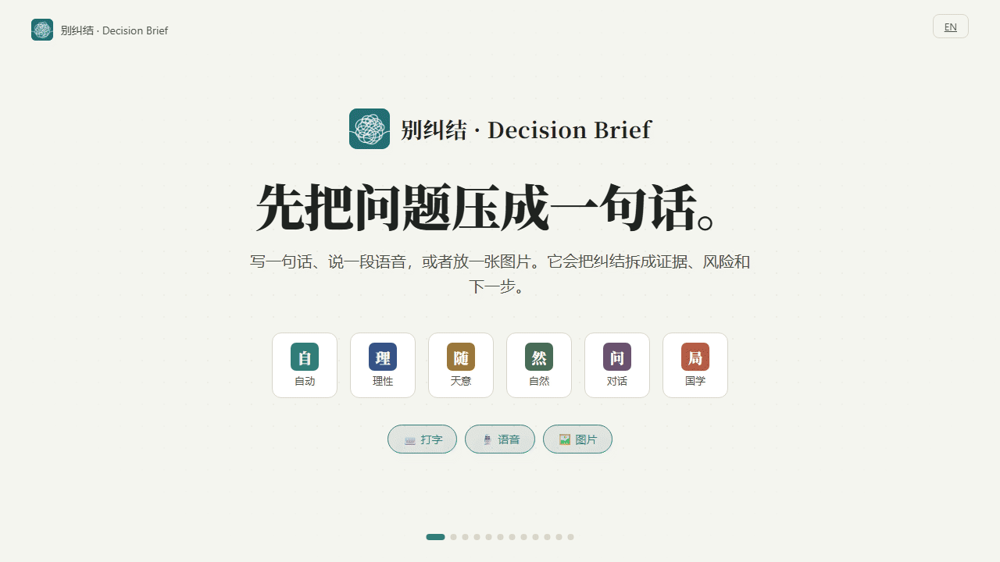
  </a>
</p>

<p align="center">
  <a href="README.en.md">English</a>
  ·
  <a href="DISCLAIMER.md">免责声明</a>
  ·
  <a href="ACKNOWLEDGEMENTS.md">致谢</a>
  ·
  <a href="https://github.com/mianbaofang/decision-brief/issues/new/choose">使用反馈</a>
  ·
  <a href="docs/releases/v0.9.0.md">v0.9.0 发布说明</a>
  ·
  <a href="https://mianbaofang.github.io/decision-brief/">中文介绍动画</a>
  ·
  <a href="https://mianbaofang.github.io/decision-brief/index-en.html">English Intro</a>
</p>

## 为什么做这个工具

《别纠结》的灵感，来自一次陪女儿收拾房间。

我女儿上小学六年级。那天我们一起整理她的房间，桌上、柜子里、抽屉里都是东西：旧本子、小玩具、贴纸、手工作品、用了一半的文具，还有一些她自己也说不清还要不要的东西。

真正难的不是收拾，而是每一步都要做选择。

这个要不要留下？那个是不是还能用？这个东西有纪念意义吗？先收书桌，还是先收抽屉？扔掉会不会以后又想起来？

大人看起来很简单的事，对孩子来说并不简单。很多东西都有一点理由留下，也都有一点理由放下。她不是不愿意收拾，而是每个小决定都要想一会儿。想多了，人就累了，房间也迟迟收不完。

那一刻我想到，其实大人也一样。只是我们的"房间"换成了工作、生活、人际关系和各种计划。

很多选择不是没有答案，而是混在一起了。情绪、风险、习惯、舍不得、怕后悔，全挤在一个问题里。别人直接说"你就选这个"并不一定有用，因为真正要承担结果的人还是自己。

所以我想做一个工具，帮人把选择先摊开。

它不替用户决定"该留还是该扔""该做还是不做"。它更像在旁边帮忙问几句：你为什么想留下？如果不留会怎样？这个选择的代价大不大？有没有一个可以先试的小动作？

这就是《别纠结》的初衷。我希望它解决的是这种很具体的场景：当人被很多小判断卡住时，有一个轻一点的工具，帮他把问题说清楚，把理由分开，把下一步变得没那么重。

所以这个 Demo 没有只做成随机转盘。随机适合"今天吃什么"这种低成本小事，但不适合所有选择。我也没有把它做成很复杂的效率系统，因为人在纠结的时候，通常没有耐心填很多表格。最好是一句话就能开始。

现在的设计里，有几种不同的入口：想认真分析就用理性分析看收益、风险、可逆性和价值匹配；只是小事卡住了可以用随机决策给自己一个推动；想换个角度可以看看自然启示或国学参考（仅作参考和娱乐）；如果连自己为什么纠结都说不清，就用对话引导让系统一步步追问。

我最在意的边界是：它只能辅助选择，不能替人承担选择。尤其是很多生活里的决定，真正重要的不是"答案看起来对不对"，而是用户有没有想明白自己为什么这样选。如果能让一个人从"我不知道怎么办"变成"我知道可以先做哪一步"，它就有价值了。

**别纠结**是一个本地优先的 AI 决策助手（decision support）。它提供 Web 桌面界面、CLI 和 Codex Skill，用 FastAPI + SQLite 运行，可以连接 OpenAI 兼容接口。它不替你做决定，只把纠结拆成证据、风险和下一步。

> 使用前请阅读 [免责声明](DISCLAIMER.md)。本项目只提供决策辅助，不替代法律、医疗、金融、心理等专业建议，也不替用户承担最终选择。

## 一眼看懂

| 场景 | 输出 |
|---|---|
| 一句话纠结 | 把问题拆成证据、风险、代价和下一步动作 |
| 六种视角 | 理性分析、随机决策、自然启示、国学参考、对话引导、自动判断 |
| 多模态输入 | 支持文字、语音和图片进入同一份决策简报 |
| 复盘记录 | 本地归档、执行结果、后悔率和决策模式回看 |

## 一句话介绍

输入一句话（也可以配图片、直接说语音），选择六种视角之一（或交给"自动"判断），几秒钟拿到一份结构化的决策简报。所有决策自动归档，可标记执行结果、回看后悔率、复盘决策模式。

## 功能图

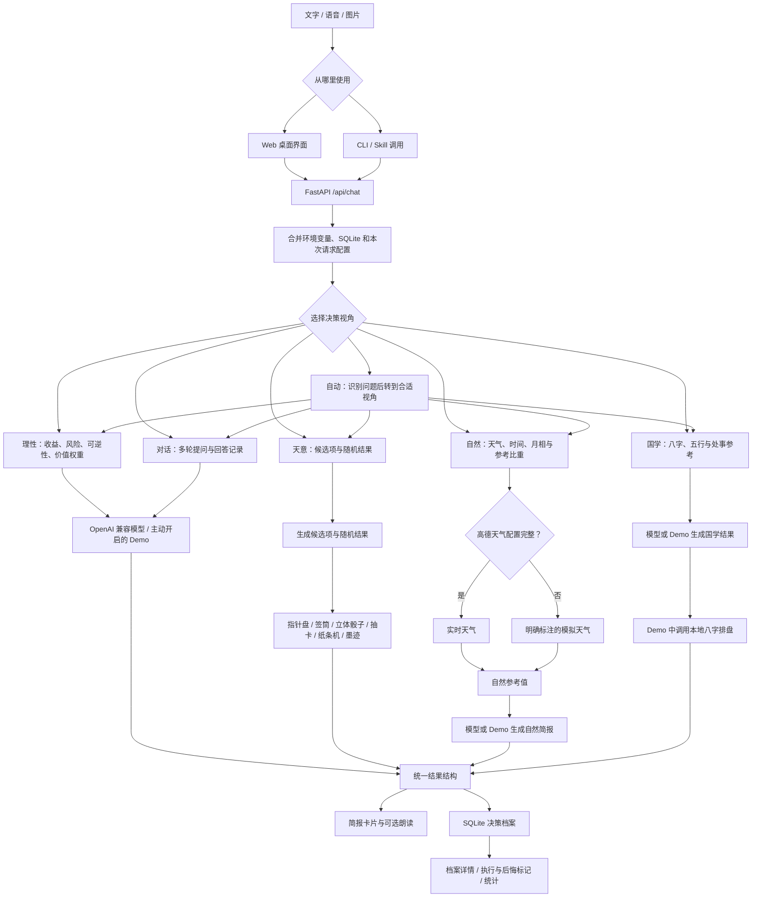
```mermaid
flowchart TD
    INPUT["文字 / 语音 / 图片"] --> ENTRY{"从哪里使用"}
    ENTRY --> WEB["Web 桌面界面"]
    ENTRY --> CLI["CLI / Skill 调用"]
    WEB --> CHAT["FastAPI /api/chat"]
    CLI --> CHAT
    CHAT --> CONFIG["合并环境变量、SQLite 和本次请求配置"]
    CONFIG --> ROUTER{"选择决策视角"}
    ROUTER --> AUTO["自动：识别问题后转到合适视角"]
    ROUTER --> RATIONAL["理性：收益、风险、可逆性、价值权重"]
    ROUTER --> RANDOM["天意：候选项与随机结果"]
    ROUTER --> NATURE["自然：天气、时间、月相与参考比重"]
    ROUTER --> DIALOGUE["对话：多轮提问与回答记录"]
    ROUTER --> CULTURE["国学：八字、五行与处事参考"]
    AUTO --> RATIONAL
    AUTO --> RANDOM
    AUTO --> NATURE
    AUTO --> DIALOGUE
    AUTO --> CULTURE
    RATIONAL --> GENERATOR["OpenAI 兼容模型 / 主动开启的 Demo"]
    DIALOGUE --> GENERATOR
    RANDOM --> OPTIONS["生成候选项与随机结果"]
    OPTIONS --> EFFECTS["指针盘 / 签筒 / 立体骰子 / 抽卡 / 纸条机 / 墨迹"]
    NATURE --> WEATHER{"高德天气配置完整？"}
    WEATHER -->|"是"| AMAP["实时天气"]
    WEATHER -->|"否"| MOCK["明确标注的模拟天气"]
    AMAP --> NATURE_EVIDENCE["自然参考值"]
    MOCK --> NATURE_EVIDENCE
    NATURE_EVIDENCE --> NATURE_RESULT["模型或 Demo 生成自然简报"]
    CULTURE --> CULTURE_RESULT["模型或 Demo 生成国学结果"]
    CULTURE_RESULT --> BAZI["Demo 中调用本地八字排盘"]
    GENERATOR --> RESULT["统一结果结构"]
    EFFECTS --> RESULT
    NATURE_RESULT --> RESULT
    BAZI --> RESULT
    RESULT --> UI["简报卡片与可选朗读"]
    RESULT --> DB["SQLite 决策档案"]
    DB --> ARCHIVE["档案详情 / 执行与后悔标记 / 统计"]
```

## 快速开始

```bash
# 1. 安装依赖
pip install -e ".[dev]"      # 开发模式
# 或
pip install -r requirements.txt

# 2. 启动服务
cd backend
python main.py
```

打开浏览器访问：

- Web UI：<http://127.0.0.1:8010/>
- API 文档：<http://127.0.0.1:8010/docs>
- 健康检查：<http://127.0.0.1:8010/api/health>

没有 LLM Key 时，页面会提示你去配置或主动开启 Demo。Demo 只返回示例数据，不会调用真实 AI。真实分析需要自己的 OpenAI 兼容 Key；图片输入还需要支持图片的模型，如 GPT-4o、Doubao-vision 或 Qwen-VL。自然模式读取实时天气时，需要填写自己的高德 Key、天气 Base URL 和城市；没有高德 API 时会使用明确标注的模拟天气。

## 六种决策视角

<p align="center">
  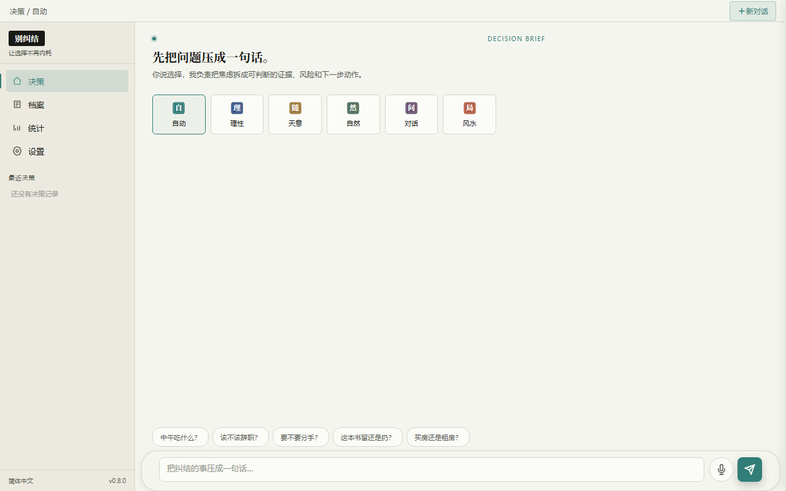
</p>

| 视角 | 印章 | 适用场景 | 交付物 |
| --- | :---: | --- | --- |
| **自动** | 自 | 不知道用哪种模式，让系统根据问题内容路由 | 自动匹配最合适的视角 |
| **理性分析** | 理 | 辞职、买房、大额消费等高后悔成本选择 | 收益 / 风险 / 可逆性 / 最小下一步 / 信心分 |
| **天意随机** | 随 | 吃什么、看什么、走哪条路等低风险小事 | 候选项 + 随机结果 + 小仪式感 |
| **自然启示** | 然 | 情绪卡住、关系选择、需要换个角度 | 位置 / 时间 / 天气 / 风向 / 月相 / 天气趋势 / 信号比重 |
| **对话引导** | 问 | 心里已有答案但不敢面对 | 三到五轮追问，帮你听见自己的声音 |
| **国学参考** | 局 | 想从传统文化角度换一种看法 | 八字排盘 + 五行喜用 + 处事参考 |

## 界面预览

<p align="center">
  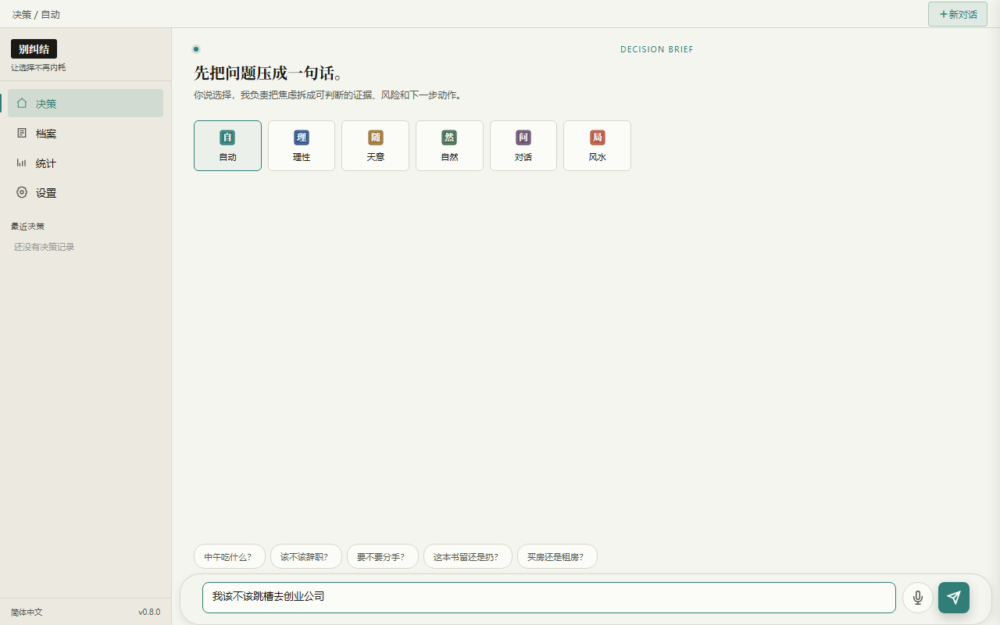
  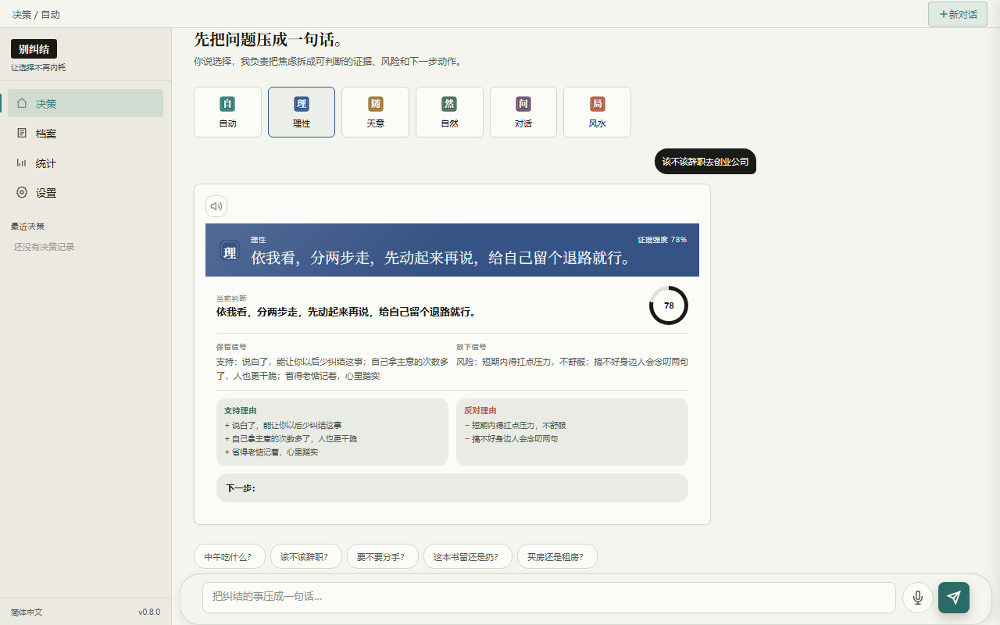
  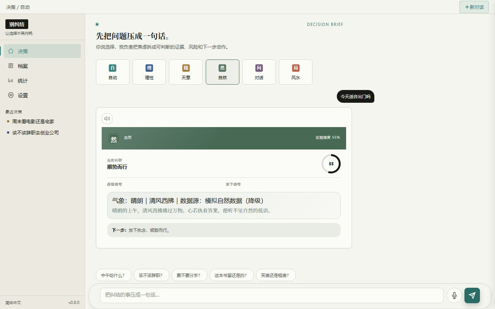
  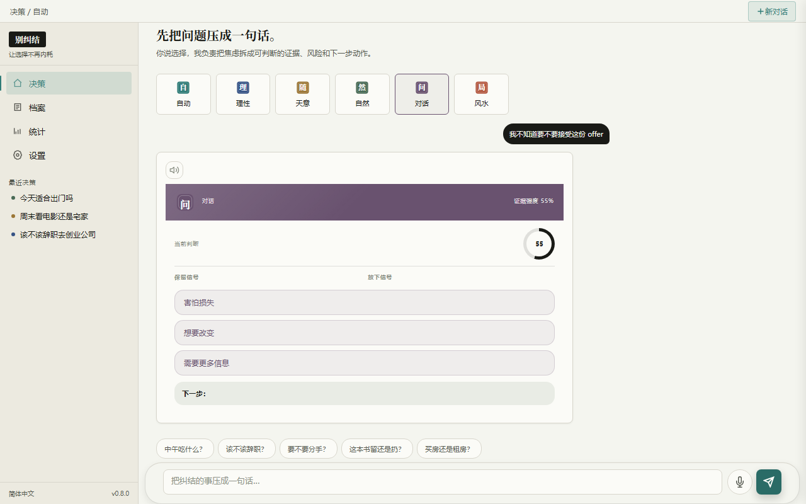
  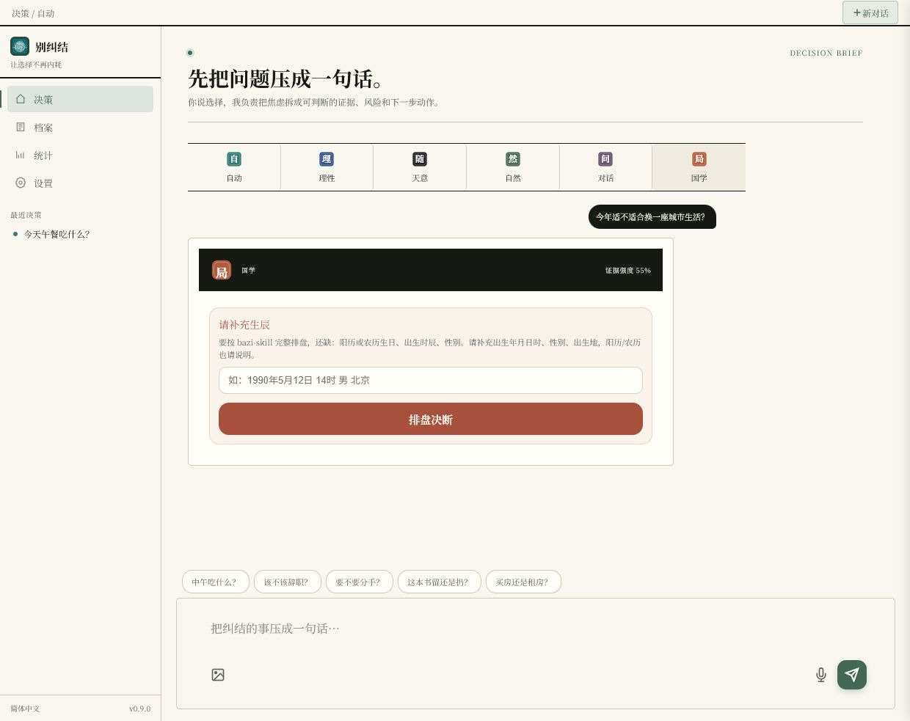
  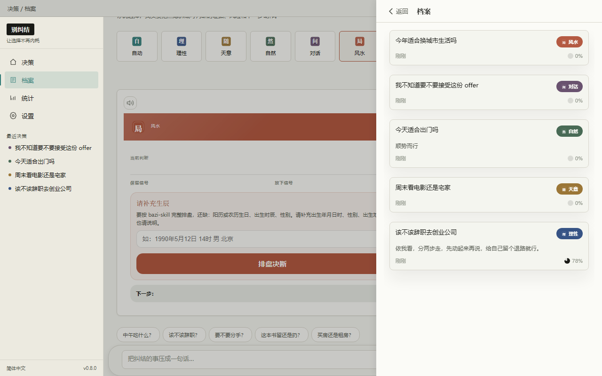
  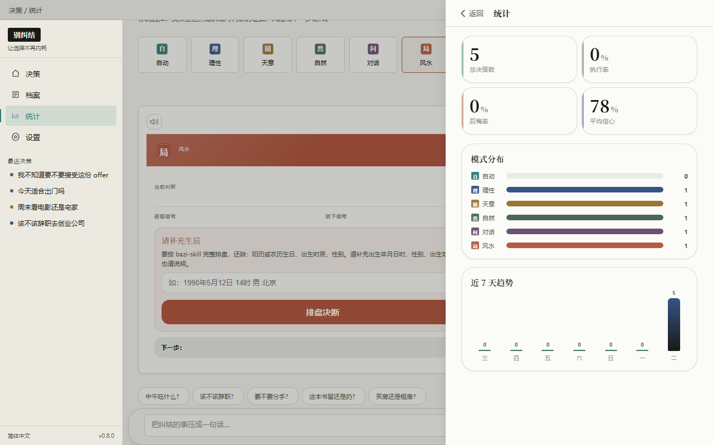
  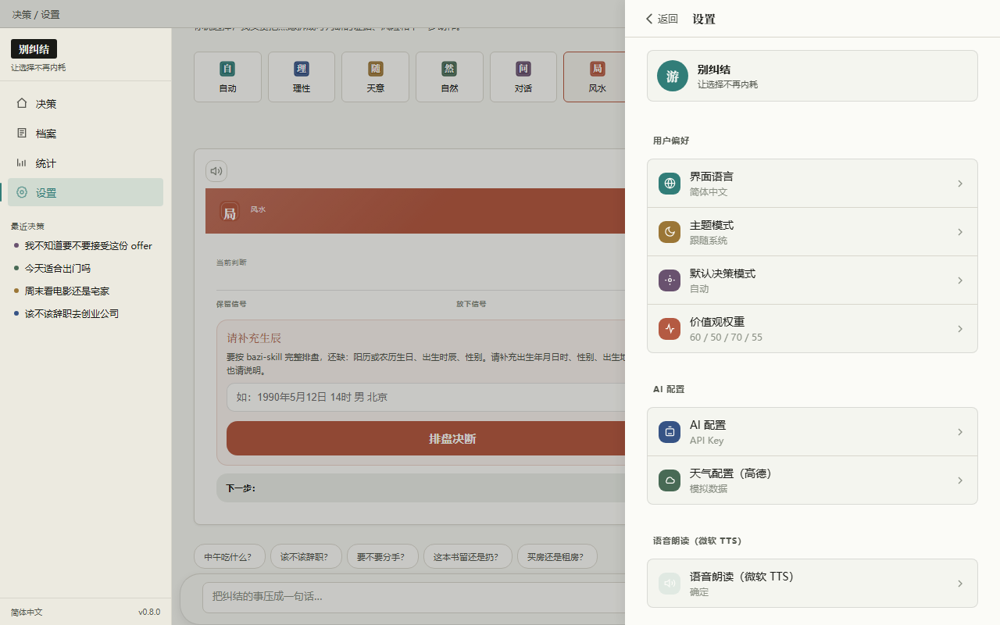
</p>

## 核心特性

- **🎴 印章式模式选择**：六个单字印章按钮（自理随然问局），中式纸感设计
- **⌨️🎙️🖼️ 三模态输入**：大圆角卡片输入框，支持键盘打字、麦克风语音、上传图片（多模态视觉分析）
- **💬 结构化简报**：不同模式使用各自的结果卡片，理性模式显示信心环与重点信息
- **📁 决策档案**：所有决策自动保存，支持标记"已执行 / 后悔"、查看详情、删除，侧栏实时同步
- **📊 决策统计**：执行率 / 后悔率 / 模式分布 / 时间线复盘
- **🔊 TTS 朗读**：Edge TTS 朗读简报内容，音色可自选（免费、无需 Key），支持自动朗读偏好
- **🎲 六种随机动画**：指针盘、签筒、立体骰子、六张抽卡、纸条机、墨迹择路，由前端代码实时绘制并随机选用
- **🌦️ 自然参考**：填写高德 Key、天气 Base URL 和城市后读取实时天气、近期趋势、月相和参考比重；未配置时使用模拟天气
- **💬 对话记录**：每轮问题和所选回答会写入 `dialogueHistory`，档案详情可以继续查看
- **🎨 四套界面样式**：原来的样子、安静工作台、决策日志、模块化工作台；另有浅色 / 深色 / 跟随系统主题
- **🌍 6 语言国际化**：简体中文 / 繁體中文 / English / Français / 日本語 / Español
- **💾 本地优先**：SQLite（WAL 模式）持久化，数据只在你自己机器上
- **🖥️ 自适应布局**：桌面端两栏 + 抽屉，移动端单栏 + 底栏，输入区宽大不局促
- **🔌 CLI + Web 双入口**：命令行与浏览器共用后端与数据库
- **🧪 Demo 预览**：没有 LLM Key 时，可在提示中主动开启 Demo，查看示例结果

## 输入方式

输入框采用豆包风大圆角卡片设计：

- **左侧**：图片上传按钮（点击选择本地图片，支持缩略图预览与一键移除，5MB 以内）
- **中间**：多行文本框（自适应高度，Shift+Enter 换行，Enter 发送）
- **右侧**：麦克风语音输入 + 青色发送按钮

配视觉模型时，图片会以 OpenAI 标准多模态格式发给 LLM，模型可直接看图给出决策建议。

## 配置 LLM 和天气

首次使用建议在"设置 → AI 配置"里填入你自己的 API Key（任意 OpenAI 兼容接口，如 OpenAI、MiniMax、DeepSeek、Moonshot、本地 Ollama、Doubao 等）。不填时，提交问题会提示你配置 Key 或主动开启 Demo。

自然模式的实时天气在"设置 → 天气配置（高德）"中填写。需要三个字段：高德 Key、天气 Base URL、城市。Key 和 Base URL 都存在时，后端才把天气配置视为完整；没有高德 API 时会使用模拟天气，界面会明确提示。

也支持环境变量（最高优先级）：

```bash
export CHOICE_LLM_API_KEY=YOUR_API_KEY
export CHOICE_LLM_MODEL=gpt-4o-mini          # 图片输入请换视觉模型如 gpt-4o
export CHOICE_LLM_BASE_URL=https://api.openai.com/v1
export CHOICE_WEATHER_KEY=YOUR_AMAP_KEY       # 自己申请的高德 Web 服务 Key
export CHOICE_WEATHER_BASE_URL=https://restapi.amap.com/v3/weather/weatherInfo
export CHOICE_WEATHER_CITY=北京
```

CLI 写入 SQLite：

```bash
python scripts/choice_assistant.py --action config-api --save-to-db \
  --api-key YOUR_API_KEY \
  --llm-model gpt-4o-mini \
  --llm-base-url https://api.openai.com/v1 \
  --weather-key YOUR_AMAP_KEY \
  --weather-base-url https://restapi.amap.com/v3/weather/weatherInfo \
  --weather-city 北京
```

## CLI 使用

```bash
# 一句话决策
python scripts/choice_assistant.py -q "该不该跳槽去新公司"
python scripts/choice_assistant.py -q "今晚吃什么" --mode random

# 查看档案与统计
python scripts/choice_assistant.py --action archive
python scripts/choice_assistant.py --action stats

# 管理单条决策
python scripts/choice_assistant.py --action decision --id <id>
python scripts/choice_assistant.py --action decision --id <id> --delete
```

完整参数见 [SKILL.md](SKILL.md)。

## 安全和边界

- 本项目是决策辅助工具，不替用户承担法律、医疗、投资、升学、就业或家庭关系等高风险决定。
- 默认本地优先：决策档案保存在本机 SQLite；用户自行决定是否配置第三方 LLM。
- 图片输入会发送给用户配置的视觉模型；上传身份证件、病历、合同、孩子照片等敏感图片前请自行评估风险。
- 国学参考和自然启示只作为视角切换与娱乐参考，不应作为严肃决策的唯一依据。
- `.env`、本地数据库、真实 API Key 和个人决策记录不应提交到 GitHub。

完整免责声明见 [DISCLAIMER.md](DISCLAIMER.md)。

## 技术栈

| 层 | 技术 |
| --- | --- |
| 后端 | Python 3.9+ / FastAPI / SQLite (WAL) / httpx |
| 前端 | 原生 HTML · CSS · JavaScript（零构建、零框架依赖） |
| CLI | Python argparse + httpx，与 Web 共用同一后端服务 |
| AI | 任意 OpenAI 兼容接口（用户自配 Key；视觉模型支持多模态图片输入） |
| TTS | Microsoft Edge TTS（免费、免 Key，支持音色选择） |
| STT | 浏览器原生 Web Speech API（免 Key） |
| 天气 | 高德开放平台 Web API（用户自配 Key、Base URL 和城市；未配置时使用模拟天气） |
| 测试 | pytest + Playwright（UI 自动化） |

## 项目结构

```text
decision-brief/
├── backend/
│   ├── main.py                     # FastAPI 入口、路由注册、前端静态文件挂载
│   ├── config.py                   # 配置优先级、敏感字段脱敏、配置完整性判断
│   ├── db.py                       # SQLite 初始化、决策档案、统计和配置读写
│   ├── models/
│   │   └── schemas.py              # 请求、响应、偏好和配置的数据结构
│   ├── routes/
│   │   ├── chat.py                 # 接收问题、合并本次配置、调用决策服务并自动存档
│   │   ├── archive.py              # 分页读取决策档案
│   │   ├── decision.py             # 查看、修改或删除单条决策
│   │   ├── stats.py                # 执行率、后悔率、模式分布和七日趋势
│   │   ├── config_api.py           # LLM、天气和界面偏好的读取与保存
│   │   ├── modes.py                # 六种决策视角元数据
│   │   └── tts.py                  # Edge TTS 音频与音色接口
│   └── services/
│       ├── llm_service.py          # OpenAI 兼容调用、Demo 数据和结果清洗
│       ├── mode_recognizer.py      # 自动模式的关键词识别
│       ├── modes_data.py           # 模式名称、印章、颜色和说明
│       ├── decision_score.py       # 理性模式的评分计算
│       ├── nature_service.py       # 自然简报生成与天气依据合并
│       ├── nature_signal.py        # 预警、趋势、月相、空气等参考值权重
│       ├── weather_service.py      # 高德实时天气、预报解析和模拟天气
│       ├── bazi_engine.py          # 生辰解析、八字排盘和五行分析
│       └── prompts.py              # 各模式提示词
├── frontend/
│   ├── index.html                  # 桌面主界面、抽屉、设置和弹窗骨架
│   ├── assets/logo-nav.png         # 小程序同款导航 Logo
│   ├── vendor/                     # 本地 Zdog 与许可证，用于立体骰子
│   ├── random-effects-preview.html # 六种随机动画独立预览页
│   ├── scripts/
│   │   ├── app.js                  # 页面启动、导航、抽屉、主题和换肤
│   │   ├── api.js                  # API 请求与前端模式注册表
│   │   ├── chat.js                 # 输入、图片、模式提交和对话回答保存
│   │   ├── brief.js                # 六类结果卡片和随机动画渲染
│   │   ├── archive.js              # 档案列表、详情和状态修改
│   │   ├── stats.js                # 统计卡片与图表
│   │   ├── settings.js             # LLM、天气、偏好、皮肤和 TTS 设置
│   │   ├── voice.js                # 浏览器语音输入与 Edge TTS 播放
│   │   ├── i18n.js                 # 六种界面语言
│   │   └── random-preview.js       # 随机动画预览页控制
│   └── styles/
│       ├── main.css                # 全局变量、布局和输入区
│       ├── chat.css                # 消息、结果卡片与随机动画
│       ├── skins.css               # 四套界面样式
│       ├── desktop.css             # 桌面布局
│       ├── archive.css             # 档案与详情
│       ├── stats.css               # 统计界面
│       ├── settings.css            # 设置与弹窗
│       └── random-preview.css      # 动画预览页
├── scripts/
│   └── choice_assistant.py         # CLI / Skill 入口，与 Web 共用 API 和数据库
├── tests/
│   ├── test_config.py              # 配置优先级、脱敏和天气完整性
│   ├── test_db.py                  # SQLite 读写
│   ├── test_routes.py              # API 路由
│   ├── test_services.py            # 决策、天气、自然参考值等服务
│   ├── test_desktop_ui.py          # Playwright 桌面交互与动画验收
│   └── test_integration.py         # 可选的运行中服务集成测试
├── docs/                            # GitHub Pages、截图、演示和版本说明
├── SKILL.md                         # Skill 参数、返回结构和调用示例
├── CHANGELOG.md                     # 版本变化记录
├── README.md                        # 中文说明
└── README.en.md                     # English documentation
```

几个入口各管一件事：浏览器从 `frontend/index.html` 启动，命令行从 `scripts/choice_assistant.py` 启动，两边最后都调用同一套 FastAPI 路由。`routes/chat.py` 负责把请求交给对应服务，`services/` 负责计算和外部调用，`db.py` 负责保存。前端的 `brief.js` 只处理结果怎么显示，不参与后端判断。

## 开源与致谢

- **License**：MIT，详见 [LICENSE](LICENSE)
- **开源依赖**：FastAPI、Uvicorn、HTTPX、Pydantic、SQLite、pytest、Playwright。
- **致谢**：
  - 八字排盘参考 [jinchenma94/bazi-skill](https://github.com/jinchenma94/bazi-skill)（MIT）。
  - 中文去 AI 腔表达参考 [op7418/humanizer-zh](https://github.com/op7418/humanizer-zh)。
- **外部服务**：
  - LLM：任意 OpenAI 兼容接口（用户自配 Key；多模态图片需视觉模型）
  - TTS：Microsoft Edge TTS（内置、免费）
  - STT：浏览器原生 Web Speech API（免费）
  - 天气：高德开放平台（用户自配 Key）

完整引用与感谢清单见 [ACKNOWLEDGEMENTS.md](ACKNOWLEDGEMENTS.md)。

## 状态

当前版本：`v0.9.0`。这一版加入四套界面样式、六种随机动画、自然模式参考值、对话回答存档和完整的高德天气配置。LLM 与高德天气都由用户自己填写；Demo 和模拟天气会在界面中明确标注。

---

<p align="center">让选择不再内耗。<br>Made with ❤️ for people who overthink.</p>
